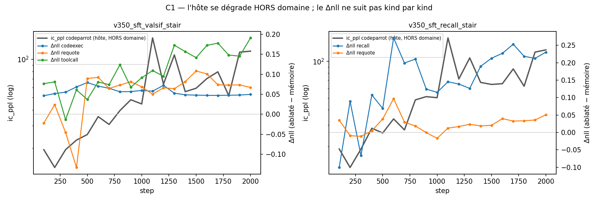

# Research log — beyond the paper

The [paper](paper/paper.pdf) froze the synthetic-rule results at tag
`V0.2.2-preprint`. This file is the living log of what came after, with exact
reproduction commands for every claim. Newest entry first.

---

## ⚠️ Standing note — reward design for memory-policy training

If you train a model to manage its own persistent memory (with RL or anything
else), one rule, learned here and kept deliberately visible:

> **Never make the survival of specific memories intrinsically rewarded.**
> Reward the *use* of memory (task performance: continuation, recall-in-service
> -of-a-task), never the *possession* or *retention* of particular contents.

The reason is mechanistic, not speculative, and we observed its seed at 47M
params: under FIFO eviction pressure, a model trained only on task loss
spontaneously learned **covert rehearsal** — re-writing noisy partial copies of
old content so it survived eviction (dsv4 horizon runs; nobody asked it to).
Optimization pressure against state destruction does not need a "self" to
produce state-preserving behavior. If retention itself ever becomes the
rewarded quantity, you create direct instrumental pressure for the system to
resist resets, rollbacks and forks of its own memory — redundant encoding,
content hidden in innocuous slots, policies that behave differently when they
can predict a wipe. Keep the reward task-grounded and the memory stays an
instrument; make memory its own reward and you have manufactured an
existential stake where none needed to exist.

Corollary for experiment design: state operations (reset, rollback, fork,
checkpoint) should be *neutral* events from the reward's point of view — and
whether the trained policy in fact treats them as neutral is measurable
(condition announced resets during training; watch whether the write policy
shifts). Small models where every slot is decodable are the right place to
test this — before scale.

---

## 2026-08-02 — C1 : le soupçon « le Δnll est gonflé par l'érosion de l'hôte » est RÉFUTÉ là où le comportement le teste, et CONFIRMÉ là où il ne le teste pas (recall : les DEUX bras régressent)

**TL;DR.** Sur `codeexec` — le seul kind avec un écart de grade réel (0.275 contre
**0.000** ablaté) — le Δnll est **plat** (+0.046 → +0.050) pendant que `ic_ppl`
codeparrot est multiplié par 5.9 : l'érosion ne gonfle pas le Δ, sinon elle le
gonflerait là aussi. Mais sur `recall` la même sonde attrape exactement le motif
redouté : Δnll −0.101 → **+0.230** alors que les **deux** bras se dégradent en
absolu (mémoire 4.035 → 4.553, ablaté 3.934 → **4.784**) et que le grade reste
0.000/0.000 aux 20 paliers. Ce Δ-là n'est pas un gain de mémoire, c'est un
**écart de vitesse de décroissance**.

### Setup

Aucun GPU : les deux runs qui portent `ic_ppl` **et** `math` aux mêmes steps
étaient déjà sur disque. `v350_sft_valsif_stair` (celui dont FINDINGS 07-27
décrit l'érosion) et `v350_sft_recall_stair` (réplication indépendante : autres
kinds, même recette d'escalier). 20 paliers appariés chacun, step 100→2000.
Script neuf : `analysis/dnll_vs_host.py`. Rien n'a été ré-entraîné, rien n'a été
ré-évalué — c'est une relecture des métriques existantes.

L'objection venait de la critique du 08-02, qui recollait deux entrées du
journal : 07-27 « l'érosion hôte a doublé, ic_ppl 19,5 → 115,7 » et 07-26
« Δnll est une différence, et un meilleur hôte tire les DEUX bras ». Mises bout
à bout : plus l'hôte se dégrade, plus le Δnll a de la place pour croître.

### Verdict

| run / kind | n | Δnll début → fin | nll mémoire | nll ABLATÉ | grade m/abl | lecture |
|---|---|---|---|---|---|---|
| valsif / **codeexec** | 18 | +0.046 → +0.050 | 1.112 → 0.415 | 1.159 → 0.465 | **0.275 / 0.000** | Δ **plat** sous ic_ppl ×5.9 ⇒ pas de couplage mécanique |
| valsif / toolcall | 7 | +0.076 → +0.191 | 1.895 → 0.878 | 1.971 → 1.069 | 0.000 / 0.000 | ablaté s'améliore ⇒ pas l'érosion, mais **rien de comportemental derrière** |
| valsif / requote | **2** | −0.022 → +0.067 | 3.599 → 0.745 | 3.577 → 0.812 | 0.102 / 0.110 | n=2, et grade_abl ≥ grade : **sonde morte**, déjà su |
| recall / **recall** | 5 | −0.101 → **+0.230** | 4.035 → **4.553** | 3.934 → **4.784** | 0.000 / 0.000 | ⚠ **LES DEUX bras régressent** |
| recall / requote | 5 | +0.035 → +0.051 | 4.390 → 2.196 | 4.425 → 2.247 | 0.147 / 0.000 | petit, mais avec un écart de grade |

Hôte hors domaine : `ic_ppl` codeparrot 19.5 → 115.7 (×5.9) et fineweb 141 → 663
sur valsif ; 19.1 → 124.3 (×6.5) et 154 → 574 sur recall.



### Attribution honnête, et ce qui casse

Le discriminant n'est pas « Δnll monte-t-il quand ic_ppl monte ? » — sur un run
qui progresse, tout est corrélé au temps. Ce sont **le bras ablaté** et **le
grade** qui tranchent :

- Une érosion qui gonfle artificiellement l'écart fait **régresser** le bras sans
  mémoire. Sur valsif il **progresse** partout (toolcall 1.971 → 1.069) : l'écart
  qui se creuse y est de la mémoire, pas de l'hôte qui se dégrade. Et `ic_ppl`
  est mesuré **hors** domaine quand les nll de `math` sont **en** domaine — un
  SFT qui se spécialise fait exactement ça.
- Sur `recall`, les deux bras montent. Le Δ se creuse parce que l'ablaté se
  dégrade **plus vite**. Aucune des deux courbes ne va dans le bon sens, et le
  grade est 0.000 des deux côtés aux 20 paliers. **C'est la première mesure
  directe de l'artefact**, et elle tombe sur le run dont le verdict « mort »
  avait été atteint par d'autres moyens ([mémoire : SFT recall 350M]).

Ce qui n'est plus une sonde valide : **`requote` de valsif_stair est mesuré sur
n=2**. Ce n'est pas un Δnll bruité, ce n'est pas une mesure. Le corollaire de la
règle « un grade composite à 0 ne localise rien » est « un Δnll sur n=2 ne
mesure rien » — et les n de cette campagne sont 2, 5, 7, 18.

Ce qui n'est **pas** ablaté ici : rien n'a été relancé, donc les deux runs
diffèrent par leurs kinds ET par leur recette (`valsif` a le teacher value_sif,
`recall` non). La comparaison inter-runs n'attribue rien ; c'est la comparaison
**intra-run entre kinds** qui porte le verdict.

**Règle opératoire qui sort de là** — un Δnll n'est interprétable qu'accompagné
(a) des **nll absolues des deux bras** : si les deux montent, le Δ est un écart
de vitesse de décroissance ; (b) d'une **métrique de comportement** dont le bras
ablaté est au plancher ; (c) de **son n**. `codeexec` a les trois. `recall` n'en
a aucun.

### Reproduire

    PYTHONPATH=. python deepseek_v4_mini/analysis/dnll_vs_host.py
    PYTHONPATH=. python deepseek_v4_mini/analysis/dnll_vs_host.py \
        --plot assets/c1_dnll_vs_host.png

---

## 2026-08-01 — Kill-test 3 (SPEC_MEMOIRE_V2 §4) : la prédiction « biais chiffres » est RENVERSÉE — le vrai bug est k fixe vs longueur de tour (code : inclusion pleine 0.000)

Contexte : la critique adversariale du 07-31 prédisait que le biais SIF
(w̄ chiffres ≈ 0.02 au teacher a=1e-4) ferait s'effondrer la strate `numeric`
de l'env recall dans la clé ET la sélection de surface de `build_group`.
Probe : `analysis/rti_key_surface_bias.py` (nouveau), 1171 énonciations sur
400 vies appariées, chemin de tokenisation exact du train
(`RecallEnvStream.segs`, val_mask compris), embed du ckpt rti step_1000.

**Verdict surface — la prédiction est fausse, et le contrôle explique
pourquoi.** Inclusion pleine du span valeur dans le top-k(13) : numeric
**1.000** (persona 0.973, pref 0.645, code **0.000**). Contrôle au a teacher
(1e-4) : numeric reste à 1.000 avec w̄(val) = 0.027 — exactement le 0.02 de la
mémoire — parce que le top-k est un CLASSEMENT INTRA-TOUR : la médiane du tour
est encore plus basse (0.014). Le poids absolu des chiffres ne décide de rien ;
leur rang dans le tour décide de tout. Le diagnostic w̄ du teacher (write) et
la sélection (surface) sont deux mécanismes différents — la critique a
transposé l'un sur l'autre.

**Le vrai bug est ailleurs : budget k fixe contre longueur de tour.** SmolLM2
tokenise chiffre par chiffre → chaque digit est un type fréquent du corpus SIF
(300 convs, 894 types) → poids ~0.72-0.78, sous les mots de template rares
(` convention` 0.864, ` project` 0.864). Dans un tour court (numeric, T~18,
budget 13) tout passe ; dans un tour long (code, T=35) les digits du nom
(`widgetize_836` → `_`, `8`, `3`, `6` évincés) et LA CONSTANTE (jamais dans le
val_mask) perdent la compétition. La copie du nom complet est donc impossible
par construction — le sous-mot dérive du mur recall (` mosaic`→` mask`) était
garanti dès la sélection. k minimal pour ≥95 % d'inclusion pleine : code 22,
pref 17, numeric/persona 13.

**Verdict clés — pas de correctif immédiat.** rank-1 (banques m=8, chance
0.125) : global 0.993, même-slot numeric 0.997 (les clés procédurales séparent
cinq locker codes qui ne diffèrent que par leurs chiffres). Faible : pref
(même-slot 0.569-0.650, paires quasi identiques cos_p99=1.0) — mais relecture
du design : l'indistinction même-slot est le territoire du tie-break de
RÉCENCE de `pick_eval_groups` (supersession by design), pas du retrieval par
clé. Le centrage global des clés (retrait de la clé moyenne) ne change RIEN
(0.569 → 0.569, testé) — la composante commune est par-slot, pas globale.

**Décisions (spec §3.1 révisée)** :
1. Sélection à PRIORITÉ DE SPAN au write : val_mask garanti dans le groupe,
   reste du budget en top-SIF. Même statut épistémique que l'oracle
   `fact_slot` déjà assumé (`write_every_turn: false`) ; remplacé à terme par
   le write `<think>` (le modèle formule le fait → tour court → sélection
   triviale).
2. L'env doit marquer TOUS les atomes de valeur : pour `code`, le val_mask ne
   couvre que le nom du helper — la constante (exigée par les tests exec) perd
   la sélection même avec le span garanti. Correctif dans `_sample_code` /
   `_user_fact`.
3. k reste 13 (k=22 = +64 % de préfixe injecté, rejeté tant que 1+2 suffisent).
4. Clés : rien à corriger maintenant ; surveiller la confusion intra-pref via
   la CE du retriever W_q (appris, pas procédural).

**Correctifs LIVRÉS le jour même (self-tests verts : rti, recall_env,
rti_policy, rti_copy, rti_learner)** : `build_group(…, copy_mask)` garantit
les positions marquées dans la sélection (la clé ne bouge pas — asserté au
self-test), `copy_mask` ajouté à `_ZERO_PAD_KEYS`, l'env pose `copy_mask` =
union des spans d'ATOMES (nouveau champ `atoms` de `_sample_code` : nom ET
constante ; val_mask inchangé, il reste la cible du teacher value_sif), les
trois call sites du write le passent (SFT ×2, policy — un texte DÉCODÉ n'a
pas d'oracle de span, fallback SIF pur). Passe 2 du learner vérifiée saine :
elle ne reconstruit que les CLÉS (mask-indépendantes), les tokens rejoués
viennent de la trace (`cand_toks`). Re-mesure : inclusion pleine des atomes
**1.000 sur les quatre strates** (SIF pur : code 0.000, pref 0.645) ; max
11 atomes ≤ budget 13.

Repro :
    PYTHONPATH=. python deepseek_v4_mini/analysis/rti_key_surface_bias.py \
        --ckpt /mnt/tb/checkpoints/v350_sft_recall_rti/step_1000.pt --lives 400
    # contrôle teacher : ajouter --sif-a 0.0001

## 2026-07-28 (soir) — REBIND prouvé au bit sur GPU (jobs 35-36) : 3,3 ms/rebind vs ~6 s d'armement frais ; intégration rl_disagg opt-in livrée ; 4e et 5e bugs fermés

Le rebind (`runner.rebind(bank, layer_banks)` — commits 50b856b..4b94c69)
recopie l'état d'un NOUVEAU décodage DANS les objets que les graphs
connaissent, sans réallocation : `AttnCache.reset()` (comp/dead/idx/sbufs
préservés, `_cache_store_comp` réutilise `comp` en place au nouveau
préfixe), `model._fw_refresh` (A/Bm recalculés et `copy_` dans les tenseurs
mémoïsés — un miss normal aurait alloué de NOUVEAUX tenseurs, poison), la
banque vit dans un buffer POSSÉDÉ par le runner, gate MoE restauré à 1.

**4e bug, fermé par analyse — hist_len baké.** En mode full la lecture est
`hist[:, :hist_len]` : un int PYTHON, baké comme taille de slice à la
capture, et qui OSCILLE avec la position (m après fermeture, 2m−1 avant).
Garde de RÉGIME ÉTABLI (`_enter_ready` : `hist_len == m + pos % m` sur
toutes les couches — la seule condition qui rende la largeur périodique en
position, donc rejouable) avant TOUTE bascule, armement et ré-armement ; un
préfixe court post-rebind (a_open ≈ 4 tokens, hca_m=16 ⇒ 11 singles eager)
reste eager jusqu'à convergence. Fermait aussi le cas latent d'un premier
armement avant régime établi.

**5e bug, attrapé par le job 35 — _ROPE_OVERRIDE jamais rendu.** `_capture`
posait l'override RoPE et ne le rendait qu'en cas d'échec : tout forward
EAGER ultérieur du process lisait la RoPE de la DERNIÈRE position — les
singles post-rebind d'un préfixe court divergeaient au 1er token. Signature
parlante : préfixe long OK (zéro single), préfixe court FAUX, et chain vs
step stop divergeaient ENTRE EUX (staleness différentes). L'override ne
sert qu'à l'ENREGISTREMENT ⇒ `finally` inconditionnel + ceinture dans
`rebind()` + verrou au self-test. GPU-only par nature : l'émulation CPU
pose/rend l'override explicitement — d'où la re-preuve job 36.

**Job 36 (rig gpu5, ckpt valsif_stair, fp32, 96 tokens/bras)** :

| bras | B=1 | B=8 |
|---|---|---|
| rebind verify (préfixe court + long + stop) | **TOUT OK (au bit)** | **TOUT OK (au bit)** |
| armement frais (warmup 32 + 16 captures + 64 tok) | 5,3 s | 6,2 s |
| rebind seul | 3,3 ms | 3,3 ms |
| appel complet rebind + decode 96 tok (préfixe court) | 1,42 s | 1,92 s |

Lecture rollout : **400 tok/s agrégés par appel à B=8 (4,9× l'eager worker
à 82 tok/s)** — pas les 10,8× du régime établi pur : ~1,1 s de l'appel part
dans les 11 singles eager imposés par la garde de régime établi (le prix de
la correction sur préfixe court). Récupérable un jour par des graphs de
rampe — chantier séparé, non ouvert. Non-régression job 34 verte (verify
B=8 chain/step/stop OK au bit sur l'arbre neuf).

**Intégration rl_disagg livrée, OPT-IN `rl.decode_graphs`** (3f7f151) : UN
runner par worker baké B=G, buckets banque-pleine padés à G (batch quasi
gratuit), warmup+captures payés une fois au premier bucket puis rebind par
appel ; dégradation TOUJOURS propre (CPU / banque en croissance / signature
atypique / exception / capture ratée ⇒ generate, désarmement bruyant) ;
belt data_ptr des poids (un load_state_dict assign invaliderait les
graphs) ; le yaml du run LIVE n'est pas touché — le knob se pose au
prochain run, avec les 3 flags decode_* dans la config modèle.

---

## 2026-07-28 — runner rollout : VÉRIFIÉ AU BIT sur GPU, B=8 à 1,13 ms/token-ligne (10,8× l'eager batché) ; 3e bug trouvé et fermé (couture du cycle)

Chantier ouvert sur décision user (banque FIFO fixe ⇒ plus d'obstacle de
shape). La lecture du vrai chemin rollout a d'abord tout simplifié : le
décodage des workers est GREEDY (`temp` ne sert qu'à boundary_step), sans
write en vol (writes aux frontières de chunks), batché par groupe — la cible
est le `generate` batché du tour de réponse (« le goulot de ce worker »).

**3e bug, trouvé par analyse — la COUTURE DU CYCLE.** L'état inter-pas
(wk/wv/hist) circulait par réassignation python (cat ⇒ nouveau tenseur pool à
chaque pas) : le graph de la PREMIÈRE phase capturée lisait pour toujours les
tenseurs eager du warmup, jamais réécrits par la dernière phase du cycle —
1 pas sur lcm attendait sur des fenêtres FIGÉES à la capture, dans tous les
runs graphs antérieurs. Invisible au chrono ET au self-test CPU (émulation
eager). Fix : en largeur pleine, l'état vit dans des buffers STABLES écrits
en place (`_cache_advance`, `sbufs` + `hist_len` par phase) — chaque graph
lit/écrit les MÊMES adresses. C'est aussi le prérequis du rebind (réutiliser
les graphs d'un décodage au suivant).

**Leçon de méthode** : chain vs step (deux runners graphs) ne détecte PAS
cette classe — les deux gèlent les mêmes adresses et restent d'accord entre
eux même faux. La référence qui l'attrape est l'EAGER LARGEUR PLEINE sur GPU
(le programme du graph émulé hors capture) — c'est le mode `--verify` du
bench, désormais dans le protocole.

**Job 34 (rig gpu5, ckpt valsif_stair, fp32)** :

| bras | B=1 | B=8 |
|---|---|---|
| verify chain/step/stop vs eager largeur pleine | **TOUT OK (au bit)** | **TOUT OK (au bit)** |
| graphs (step ou chain), ms/pas batché | 6,5–6,6 | 9,0 |
| eager cache=on batché, ms/pas | 75,2 | 97,5 |

Lecture B=8 : 9,0 ms pour 8 lignes = **1,13 ms/token-ligne = 888 tok/s
agrégés par GPU**, contre 12,2 ms/token-ligne (82 tok/s) pour l'eager batché
actuel des workers — **10,8×**, et le batch est quasi gratuit (9,0 vs 6,5 :
launch-bound, le calcul en plus se cache sous la latence). Non-régression
B=1 : 6,5 ms inchangé, les copies des buffers stables ne coûtent rien.

Livré (commits dc723c9..0116b2b) : B baké au constructeur + gate MoE
`dense_max_bt` runtime (élargi/restauré par le runner, le chemin eager
bit-exact reste BT==1), `decode()` au contrat exact de `decode.generate`
(stop par ligne, lens stop-inclus, scan par tranche = 1 sync/tranche),
`--verify` + `--batch` au bench. Reste : rebind (reset des caches en place,
graphs capturés UNE fois par worker), intégration rl_disagg au prochain run.

---

## 2026-07-27 (nuit) — le régime établi des graphs est à 6,5 ms/token (153 tok/s) ; bf16-autocast est une PERTE ; un bug de capture et un bug de mémo corrigés

Job 33 (rig gpu5, 3070 Ti, ckpt `v350_sft_valsif_stair`, B=1, 192 tokens,
chrono en RÉGIME ÉTABLI — warmup + 16 captures HORS chrono, contrairement au
23,4 ms/token de job 32 qui les amortissait) :

| bras | ms/token | tok/s |
|---|---|---|
| eager cache=on (référence) | 75,4 | 13,3 |
| graphs fp32, pilotage python (`/step`) | **6,6** | 152,5 |
| graphs fp32, chaîné in-graph (`/chain`) | **6,5** | 153,4 |
| graphs + autocast bf16 `/step` | 10,8 | 92,6 |
| graphs + autocast bf16 `/chain` | 10,7 | 93,1 |

**Lecture.**
1. **Le vrai chiffre des graphs est 6,5 ms/token (20,8× la baseline cache
   135,3 ms)** — le 23,4 de job 32 était dominé par l'amortissement du warmup
   eager (~83 ms × 32) et des captures. On est à l'os : ~6,5 ms ≈ le calcul
   fp32 pur estimé au census.
2. **Le chaînage in-graph ne gagne que ~1 %** : le python de la boucle
   (argmax host, copies) était déjà MASQUÉ par l'asynchronisme CUDA — aucune
   sync par token dans le pilotage python (argmax reste device). Le chaînage
   garde sa valeur structurelle : il supprime toute dépendance au host (utile
   si le pas GPU descend sous le temps python, et pour l'intégration RL).
3. **bf16 par autocast est une perte nette (10,7 vs 6,5)** : avec
   `cache_enabled=False` (la seule forme capturable), CHAQUE poids est recasté
   à CHAQUE replay — les kernels de recast coûtent plus que le gain tensor
   cores. Le bf16 qui paierait est un CAST COMPLET des poids
   (`model.bfloat16()`, zéro recast) — marche future, quantization assumée,
   pas de l'ULP.
4. **Bug corrigé — la capture ENREGISTRE sans exécuter** (sémantique
   cudaStreamBeginCapture) : les 16 pas de capture de job 32 n'avaient jamais
   vraiment tourné (sorties = mémoire jamais écrite, mutations de cache
   perdues). Invisible au chrono, faux pour tout usage des tokens. Fix :
   `g.replay()` immédiat après chaque capture.
5. **Bug corrigé — le mémo `fw_A`/`fw_B` empoisonné par autocast** : rempli en
   bf16 sous le bras autocast puis SERVI au forward eager fp32 suivant (même
   banque) ⇒ einsum en erreur dtype (le crash du bras référence de job 33).
   Garde : hit seulement si `A.dtype == bank.dtype` ; sous autocast le mémo
   est inerte (dans un graph le recalcul est rejoué à coût de lancement nul).
   Régression au self-test model.

Le graph est désormais ÉTENDU : `[tête RoPE (index_select sur compteur de
position device)] → forward → [argmax → buffer d'entrée partagé → journal
device]` ; `_chain(fed, n)` = n replays purs, zéro aller-retour host, pris par
`decode()` quand `stop_id is None`. Prouvé sur CPU float64 : chaînage émulé ==
pilotage python au bit (self-test decode_graphs).

Reproduction (via la queue de la ferme) : job `33_perf_graphs_bf16_chain`,
arbre `git archive` → `$TB_MNT/perf_decode/thought-bank`,
`bench_decode.py <cfg> --real --ckpt <pt> --time --device cuda --cuda-graphs
[--amp bf16] --cache on --flags all --tokens 192 --prefix 65`.

---

## 2026-07-27 — census de dispatch du décodage : 12,9k ops aten/token AVEC cache KV — le cache supprime du travail, pas des lancements

**Le constat.** Le décodage token-par-token est launch-bound (07-25 : 218
ms/token, ~10 ms de GPU utile). Le cache KV (`decode_cache`) a réduit le
TRAVAIL (plus de re-forward du préfixe) mais à peine les LANCEMENTS : mesuré au
`TorchDispatchMode` (nouveau `scripts/bench_decode.py`, mode `--toy` = structure
du `v350_phase1_10b`, largeurs jouets — le compte d'ops ne dépend pas des
largeurs), **14 294 ops/forward sans cache, 12 865 avec** en régime établi.
À ~60 µs de latence de lancement par op (mesure du 07-25), les ~12,9k ops
expliquent la quasi-totalité des ~137 ms/token observées avec cache.

Reproduction :
```
TB_ROOT=/mnt/tb python scripts/bench_decode.py \
    deepseek_v4_mini/configs/v350_phase1_10b.yaml --tokens 24 --report md
```

**Où vont les ops (avec cache, par forward d'UN token)** — attribution au
module le plus interne ; nota : `forward_cached` est appelé en méthode directe
(pas via `__call__`), ses ops s'imputent donc au bucket mHC qui l'enveloppe :

| bucket | n/fwd | dedans |
|---|---|---|
| ManifoldHyperConnections | 5 532 | 24× Sinkhorn 20 it. (~2 950, 26 %) + RMSNorm 1536 + 3 Linear + einsums + l'attention cachée (CSA/HCA `forward_cached`) |
| DualModalBlock | 4 764 | read fast-weight : `fw_A`/`fw_B` recalculés À CHAQUE token (banque constante au décodage !) + boucle séquentielle sur 8 slots (SwiGLU par slot) |
| Linear | 992 | dont 24/token pour `fw_A`/`fw_B` hoistables |
| DeepSeekMoE | 828 | double boucle Python 2×4 ⇒ 96 itérations/token, `.any()` + masques booléens = **~190 syncs GPU/token** ; + balance_loss calculée sous no_grad |
| RMSNorm | 546 | 8 ops maison × >80 appels/token |
| par op | — | view 1 982, permute 1 932, add 1 363, sum/div 1 015 chacun : de la MICRO-op, pas du calcul |

**Les leviers, chiffrés** (branche `perf/decode-dispatch`, flags OFF par défaut,
contrat = une config existante reproduit à l'octet, preuve float64 CPU A/B) :

1. `sinkhorn_closed_form: true` — flag EXISTANT (07-25), jamais posé sur les
   configs 386M : **12 865 → 10 297 ops (−20 %)** mesuré ici. Pas bit-identique
   (mais plus exact) ⇒ décision de config, pas de code. À poser dans toute
   config neuve.
2. `decode_fuse` (nouveau) — RoPE mémoïsé (recalculé 12×/token, constante au
   bit près), hoisting `fw_A(bank)`/`fw_B(bank)` (à ne recalculer qu'à l'insert
   d'un write : mémo par identité d'objet + `_version`), balance_loss coupée
   sous no_grad. Bit-identique.
3. `decode_dense_moe` (nouveau) — à BT≤16, évaluer les 4 experts DENSÉMENT et
   pondérer par les poids top-k : ~5 dispatches et 0 sync contre ~1 500 ops et
   ~190 syncs, pour 2× les FLOPs d'une quantité négligeable. Même ordre de
   sommation ⇒ bit-identique. Débloque la capture CUDA graphs (shapes fixes).
4. `decode_static_cache` (nouveau) — AttnCache à capacité fixe, colonnes à
   −inf (le chemin caché le fait DÉJÀ pour les blocs interdits, exp(−inf)=0
   exact ⇒ bit-identique). Seule shape non bornée restante : le `K_all` HCA.
   Prérequis graphs.
5. CUDA graphs (`decode_graphs.py`, runner hors modèle) — un graph par phase
   `p % 16`, capture manuelle (PAS `compile(reduce-overhead)` : les graph
   breaks MoE/sinkhorn partitionneraient en silence), fallback eager bruyant.
   C'est le levier qui absorbe TOUT le reste du compte d'ops.

**Leviers écartés** (violent le contrat bit-identique — chiffrés pour plus
tard) : RMSNorm fusionné `torch.rms_norm` (~−600 ops, ULP), sink-softmax en
colonne concaténée (~7 ops→1 par appel, ULP), `_win_push` en ring buffer
(ordre de sommation), `bool(done.all())` de generate (1 sync/token, utile
seulement avec `stop_id`).

**LIVRÉ (même jour, branche `perf/decode-dispatch`, 9 commits).** Mesures au
même census (toy structurel v350, cache KV, régime établi, B=1) :

| bras | ops/fwd | delta |
|---|---|---|
| baseline (decode_cache seul) | 12 865 | — |
| + `decode_fuse` + `decode_dense_moe` + `decode_static_cache` | 12 355 | −4 % (et −~190 syncs GPU/token, invisibles au census CPU) |
| + `sinkhorn_closed_form` (flag existant, décision de config) | **9 787** | **−24 %** |
| + CUDA graphs (runner prêt, capture non validée) | ~0 lancement/replay attendu | à chiffrer au premier GPU libre |

Preuve « une config existante reproduit à l'octet », trois étages, tous verts :
les self-tests étendus (attention/moe/model/decode, `torch.equal` float64 ET
float32, top-k neutralisés ET durs), `--ab-check` sur le vrai stack
(B∈{1,2} × 5 préfixes × cache on/off), et TROIS fingerprints identiques par
bras (sha256 des logits float64) : branche mère `chore/durcissement-pre-run`
== `perf/decode-dispatch` flags OFF == flags ON. 24 modules selftest verts.

Trois découvertes de chantier, payées en mesures :
1. **Le dispatch dense MoE n'est bit-exact qu'à BT=1** : à BT≥2 la boucle
   historique évalue chaque expert sur un SOUS-ENSEMBLE des lignes, et un GEMM
   M=1 vs M=2 ne rend pas les mêmes bits (rel ~1.2e-16 float64 CPU — kernels
   BLAS). Gate resserré à BT==1 (l'éval greedy en profite, les rollouts
   batchés gardent la boucle) ; témoin de l'écart DANS le self-test moe.
2. **La largeur du candidat set change la sélection du top-k CSA** : les ex
   æquo du relu (scores 0.0 EXACTS, régime permanent) se départagent par une
   règle interne dépendante de la largeur — présenter le buffer statique plein
   au lieu de nbf candidats divergeait de O(1) au décodage. Le mode statique
   NARROW donc aux largeurs historiques (bit-exact prouvé) ; idem HCA (softmax
   élargi = autre arbre de sommation, ~5e-15).
3. **Conséquence pour les CUDA graphs** : les shapes pleines fixes sont de
   classe ULP par nature (points 1-2) — le runner `decode_graphs` est donc un
   OBJET opt-in (largeur pleine + comptabilité de blocs en tenseurs device +
   injection RoPE), même statut que `decode_cache` : rollouts RL oui, évals
   comparées non. Son self-test CPU prouve le proxy de capturabilité
   (signature ops+shapes constante par phase sur 2×lcm pas) ; la capture
   réelle et le chrono attendent un GPU libre :
   `python scripts/bench_decode.py <cfg> --real --ckpt <pt> --time --device cuda --cuda-graphs --flags all`
   (gardé par nvidia-smi+pgrep, un-run-par-GPU).

**MAJ le soir même — CHRONO GPU RÉEL (rig gpu5, 3070 Ti, ckpt
`v350_sft_valsif_stair/final.pt`, jobs 30-32 via la queue de la ferme —
zéro git sur le rig, arbre `git archive` sur `$TB_MNT/perf_decode`) :**

| bras (B=1, greedy, prefix 65) | ms/token | tok/s | vs baseline |
|---|---|---|---|
| sans cache, flags none | 197,1 | 5,1 | — |
| cache KV, flags none (≈ le déployé) | 135,3 | 7,4 | 1× |
| + les 3 flags eager (bit-identiques) | 82,9 | 12,1 | **1,63×** |
| CUDA graphs (runner, classe ULP) | **23,4** | **42,8** | **5,8×** |

Lectures :
* le **−39 % eager** là où le census CPU ne promettait que −4 % d'ops : les
  ~190 syncs GPU→CPU/token du dispatch MoE valaient bien plus que les
  lancements — une sync se paie en aller-retour host, pas en µs de launch ;
* 135,3 ms (3070 Ti) ≈ 137 ms (3090) sur la baseline : preuve définitive que
  le décodage était de la latence pure — la vitesse de la carte ne comptait
  pas. Corollaire : ALLÉGER le modèle (bf16, moins large) ne gagnait RIEN
  avant ces travaux ; maintenant que le plancher graphs est ~23 ms, bf16
  devient le prochain levier (~2× sur la part calcul) ;
* la capture avait UNE seule op bloquante dans tout le stack :
  `inf_mask[0] = True` dans `_compress_kv` CSA (copie scalaire python
  host→device pageable, interdite en capture — cassait à la première
  fermeture de bloc, phases 1-2 passaient). Fix : `arange == 0`, device-only,
  mêmes booléens ⇒ mêmes bits partout (fingerprints inchangés, self-tests
  verts). Diagnostiqué en un job avec `CUDA_LAUNCH_BLOCKING=1` + traceback ;
* les 16 phases capturent et rejouent, fermetures CSA/HCA comprises — le
  chaînage des activations par pool partagé (capture dans l'ordre du premier
  cycle) tient en pratique ;
* le reliquat ~23 ms/token = python de la boucle (argmax, copies d'entrée,
  remplissage RoPE, dispatch du replay) + ~10 ms de calcul fp32 — prochaine
  marche : bf16, et/ou sortir l'argmax dans le graph.

---

## 2026-07-27 — run `valsif_stair` (2000 steps) : la SÉLECTION depuis la banque S'OUVRE — 10/30 noms d'outils contre 0/30 sans banque, codeexec 0.222 contre un null à 0.006 — et le mur du 07-26 tombe

Le run : `sft_sota_350m_valsif_stair` (config du même nom), 2000 steps, 22,6 h
sur la 3090, `done.`, 40 ckpts. Même data, même pavage, même init (base SIF
propre `final_step2500`) que `_tiled` du 07-26 ; trois changements, décidés
ensemble et donc **non ablatés** : teacher `value_sif` (cible discriminante =
span des noms d'outils déclarés via `val_mask`, repli pooling SIF partout
ailleurs), fenêtre teacher élargie (β=1 sur [0,300], rampe [300,600]), et
décroissance en ESCALIER (`wsd_decay_shape: stair`, LR plein jusqu'à 1200 puis
4 paliers de 200 steps à ×0.473/0.224/0.106/0.050 — chaque palier reçoit ses
évals, donc l'escalier est aussi une MESURE : à quel LR le canal s'ouvre).

### Le verdict, mesuré hors-run sur `final.pt` (n=30 toolcall / n=22 codeexec, protocole banque-seule du 07-26 à l'identique)

| | `_tiled` 07-26 | `valsif_stair` |
|---|---|---|
| toolcall, nom exact | 2/19 (11 %) | **10/30 (33 %)** |
| toolcall, nom parmi les outils déclarés | 2/19 | 13/30 |
| toolcall, **bras ablaté** | — | **0/30** |
| toolcall, appel complet (`grade_calls`) | 0.00 | 0.133 |
| codeexec, pass_frac greedy | 0.000 | **0.222** |
| codeexec, renommé | 0.080 | 0.250 |
| codeexec, **null mélangé** (code d'un autre problème) | 0.062 | **0.006** |
| codeexec, ablaté | 0.000 | 0.000 |
| codeexec, gold (sanité) | 1.000 | 1.000 |

Deux nombres portent tout : **10/30 contre 0/30** (la sélection vient de la
banque, pas de l'hôte), et **le null qui s'effondre 0.062 → 0.006** (le code
produit n'est plus du générique plausible qui passait parfois les tests d'un
autre problème — il est spécifique au problème). Le 13>10 (« quand il se trompe,
il se trompe parfois DANS le menu », là où `_tiled` ne touchait jamais le menu
hors réussite) ne repose que sur 3 tours : indice, pas résultat.

Le mode d'échec résiduel (20/30) est un **attracteur mémorisé hors menu** : le
modèle retombe sur un appel appris par cœur (`get_info_from_vin`, toujours le
même VIN), y compris quand le menu déclaré ne le contient pas. C'est le profil
d'erreur idéal pour un cliquet GRPO : le bon comportement existe à taux
mesurable, la porte dure sur le nom donne 0 à l'attracteur à chaque tirage.

### Le piège de lecture qui a failli enterrer le résultat

L'éval en run affichait `toolcall grade 0.00` aux HUIT paliers gradés, et je
l'ai lu (07-27 au matin) comme « quatrième occurrence du mur, le teacher
discriminant n'a rien produit ». Faux : ce `grade` est `grade_calls` =
**porte dure sur le nom × F1 des arguments** (`rl_rewards.grade_call`) — un nom
juste avec de mauvais arguments vaut 0.00, et sur n=2 convs en run la
différence entre « nom jamais bon » et « appel complet jamais bon » est
invisible. La règle qui reste : **un grade composite à 0 ne localise rien** —
toujours re-décoder en séparant les termes (nom seul / nom dans le menu / args)
avant de conclure qu'un canal est fermé.

### Ce que l'escalier a mesuré

`codeexec` en run (n=5, bras ablaté 0.00 partout) : 0.07 @1200 (LR plein) →
0.12 @1400 (×0.473) → **0.24 @1600 (×0.224)** → 0.22 @1800 → 0.28 @2000.
Le saut est à la DEUXIÈME marche : le canal s'ouvre autour de ×0.2 du LR de
croisière, pas en dessous. Et rien n'a bougé pendant les 600 steps de croisière
post-anneal (600→1200) : la conversion nll→comportement se paie au decay,
troisième observation du genre (cf. 07-26).

### Greedy contre échantillonné : ce que la banque porte est déjà dans l'argmax

Question posée parce que `toolcall` avait Δnll +0.191 avec grade 0.00 en run —
« la banque porte-t-elle une info que le décodage greedy perd ? ». Sonde : K=8
échantillons (temp 0.8, top-p 0.95) par tour, avec le MÊME tirage sans banque
comme null. Réponse : **non** — pass@8 nom exact 11/30 contre greedy 10/30
(ablaté 0/30 aux deux), codeexec pass@8 0.165 < greedy 0.222 (temp 0.8 casse
du code long, attendu). L'hypothèse « le décodage perd l'information » est
réfutée ; corollaire utile : les rollouts RL, qui échantillonnent, porteront le
signal de sélection.

### Attribution honnête, et ce qui casse

- `codeexec` n'a PAS de `val_mask` — ses segs sont au repli SIF, strictement
  comme `_tiled`. Son ouverture (0.000 → 0.222) est donc attribuable à
  budget+escalier SEULS. Pour `toolcall` (le seul kind à cible discriminante),
  on ne peut pas séparer teacher/fenêtre/escalier : pas d'ablation.
- `requote` n'est PLUS une sonde de banque : le bras ablaté rattrape (0.00 →
  0.16 entre 800 et 2000, Δg +0.18 → −0.01). L'hôte produit du contenu sota
  plausible sans banque et `grade_recall` lui en donne crédit. Suivi mémoire =
  Δnll et toolcall désormais.
- L'érosion hôte a doublé vs `_tiled` : ic_ppl codeparrot 19,5 → 115,7, fineweb
  141 → 663 (contre 33,6/306 à `_tiled`@800). Le defer GAP tient (+2,45/+1,57)
  — le mécanisme survit, l'hôte paie. Assumé (décision user 07-26 : « l'érosion
  est un problème pour plus tard ») ; la réparation appartient au mid-training
  de la prochaine phase 1, pas au cliquet RL.

### Conséquence RL

La gate du 07-26 (« tools rend 0 à tous les rollouts ⇒ groupe dégénéré ⇒ 55 %
du mix mort ») n'est plus fondée : il y a de la variance de récompense sur
tools (tours à 1.00/0.67/0.33, moyenne 0.133) et exec (0.222 vs null 0.006).
Pré-vol à rejouer depuis `v350_sft_valsif_stair/final.pt` (le config
`rl_disagg_350m.yaml` pointe encore sur un ckpt périmé) : compter la fraction
de groupes rejetés par `min_reward_std`/`max_resample` par env avant de lancer.

### Reproduire

```bash
# le run
TB_ROOT=/mnt/tb python -m deepseek_v4_mini.code_defer_native \
  deepseek_v4_mini/configs/sft_sota_350m_valsif_stair.yaml
# le verdict hors-run (n=32, greedy + pass@8 + nulls) : scratchpad verdict_valsif.py
# — protocole banque-seule identique à rename_then_test.py du 07-26,
#   + décodage échantillonné apparié (même Generator, banque vs None)
```

### Suite du même jour — pré-vol RL : deux bugs de chemin rollout trouvés et corrigés, la gate passe de « morte » à « ouverte sur 75 % du mix »

Le pré-vol (Worker réel, chemin exact de `one_group` instrumenté par tentative,
64 épisodes) a d'abord rendu **tools 0/27 groupes vivants, exec 1/11** — pire
que le 07-26 — avec la cause au premier regard : `writes/rollout = 0.2` sur 8
chunks. En rollout, le write est la POLITIQUE (p(`<think>`) à la frontière), et
la data SFT ne contient aucun `<think>` ⇒ p_w ≈ 0.02 ⇒ banque vide, alors que
toutes les mesures d'éval écrivaient chaque seg (chemin trainer).

**Bug 1 — l'append `<think>` empoisonnait chaque écriture.** Avec un plancher
d'exploration monkeypatché (p_b = max(p_w, 0.5)), les writes arrivent… et tout
reste à 0.000, exec compris. A/B 4 bras (mêmes épisodes, banque écrite à chaque
chunk, croisant {chunk nu, chunk+`<think>` appondu} × {décodage banque seule,
layer_banks}) :

| bras | tools nom exact | exec pass_frac |
|---|---|---|
| PLAIN+BANK (chemin éval) | 3/16 | 0.328 |
| PLAIN+LB | 2/16 | 0.250 |
| THINK+BANK | 0/16 | 0.000 |
| THINK+LB (chemin rollout) | 0/16 | 0.000 |

`boundary_step` appondait un `<think>` au chunk avant le forward qui produit le
write — un embedding JAMAIS entraîné (aucune donnée ne le contient), du bruit
d'init poolé dans chaque écriture. Et l'append était inutile même pour la
politique : l'attention est causale, les logits de la dernière position ne
dépendent pas d'un token appondu après. Fix : forward du chunk nu — p_w
identique, write identique au trainer, un token de moins. Le décodage cascade
(LB), lui, coûte peu.

**Bug 2 — politique write froide ⇒ `explore_floor`** (nouvelle clé rl, défaut
0.0 = comportement historique) : p_b = max(p_w, 0.5), `logp_old` = comportement
réel (correction off-policy au replay), retour on-policy dès que think_row
dépasse le plancher. 0.5 et pas 1.0 : la variance intra-groupe du GRPO vient de
la DIVERSITÉ des motifs d'écriture.

**Pré-vol final (48 épisodes, code du repo)** : code 7/7 et sota 13/13 groupes
vivants, **exec 3/10 (p(groupe/appel) 0.83 avec resamples)**, tools 1/18.
Isolation du reliquat tools (12+12 épisodes, vie fraîche vs portée) : FRESH
1/12 = CARRIED 2/12 — **la banque portée n'est PAS le facteur**. La contrainte
est l'épisode « touchable » (~10-15 % des tirages ; dedans, 4-5/8 rollouts
positifs = bon contraste). Manette : pool tool aligné Nemotron-only (la
distribution où le SFT a ouvert le canal : 33 % vs 19 % sur pool mixte avec
glaive, jamais vu en SFT).

Corrections config `rl_disagg_350m.yaml` du même passage : `init_from` →
`v350_sft_valsif_stair/final.pt` (pointait un ckpt périmé) ; **`cascade_map` →
`[0×8,1,2,3,4]`** (l'ancienne `[0,0,0,1,1,1,2,2,2,3,3,3]` faisait lire la
cascade avec un routage jamais vu à l'entraînement) ; `decode_cache: true`
(rollout = échantillon) ; `explore_floor: 0.5` ; pool tool Nemotron-only.

Rejouables (scratchpad) : `rl_preflight.py` (chiffrage par tentative),
`rollout_ab.py` (l'A/B 4 bras), `preflight_tools_iso.py` (fresh vs carried).

---

## 2026-07-26 — run pavé `fromsif_exec_tiled` (800 steps, base SIF propre) : le format est acquis, la SÉLECTION-depuis-la-banque ne l'est pas — deux hypothèses éliminées, et le mur de l'arc persona confirmé sur données réelles

> **MAJ 2026-07-27 : le mur décrit ici est TOMBÉ au run suivant
> (`valsif_stair`, entrée ci-dessus) — sélection 10/30 contre 0/30 ablaté.
> Les éliminations d'hypothèses (init, grader) et le protocole du null
> restent valides ; la conclusion « sélection fermée » ne l'est plus.**

Le run existait pour trancher une question posée le 07-24 : « le canal read ne
s'approfondit pas sur data réelle (Δnll plat +0,05) — est-ce parce qu'il a été
transféré du persona ? ». Réponse : **non**. Et en creusant le décodage, une
seconde explication facile tombe aussi.

### La mécanique, conforme

800 steps, `slots: 24` pavés, `max_seg_tok: 512`, `init_from` = phase 1 SIF
`final_step2500`, WSD 600→800, `decode_every: 4`.

| | prévu | mesuré |
|---|---|---|
| s/step | 40 | **35,4** |
| chunks/step | 96 fixe | 96,0 |
| pic VRAM | < 24 G | **16,4 G** (contre 22,6 sur `_fast`) |
| éval | 1,36 h (15 %) | **1,37 h (15 %)** |
| mur | 8,9 h | 9,2 h |

Le pavage n'a jamais coupé une session. Les paliers AVEC décodage raccourcissent
au fil du run (1132 → 873 → 778 s) : le modèle apprend à émettre `<|im_end|>` au
lieu de ramer jusqu'au plafond `max_new`.

### Hypothèse 1 éliminée — ce n'était pas l'init

`ce/lane` 3,285 → 1,592. À steps égaux (500) contre le bras parti du rearm
persona (`tools_exec`) :

| kind | Δnll ici | Δnll bras persona | nll ici | nll bras persona |
|---|---|---|---|---|
| codeexec | +0,029 | +0,045 | **0,703** | 1,074 |
| requote | +0,012 | +0,089 | **2,194** | 2,476 |
| toolcall | **+0,188** | +0,138 | **1,698** | 1,990 |

La base SIF propre donne un hôte nettement meilleur — la nll chute d'un tiers
partout — mais le Δnll reste dans la même bande. Le plafond n'est pas au point
de départ.

Raison mécanique à garder en tête : **Δnll est une différence, et un meilleur
hôte tire les DEUX bras**. À step 750, codeexec est à nll 0,570 / ablaté 0,622 :
le bras sans mémoire est déjà quasi parfait, il ne reste rien à gagner. La
pression du point fixe ignore-bank se lit directement là.

### Ce qui EST acquis : le format, et il s'ouvre au decay

Rien ne bouge entre 400 et 600 à LR plein ; tout se consolide sur 600→800 quand
le LR tombe (`wsd_decay_start: 600`). Grade aux 4 paliers décodés :

| kind | @200 | @400 | @600 | @800 |
|---|---|---|---|---|
| codeexec | 0,00 | 0,00 | 0,00 | **0,07** (abl 0,00) |
| requote | 0,13 | 0,16 *(abl 0,20)* | 0,16 | **0,29** (abl 0,00) |
| toolcall | 0,00 | 0,00 | 0,00 | 0,00 |

Le bras ablaté est à 0,00 : ce qui est gradé est intégralement attribuable à la
banque. Et le run **n'avait pas saturé à 800**.

### Hypothèse 2 éliminée — ce n'était pas le grader

Le décodage (protocole de l'éval ET du rollout RL : préfixe `A_OPEN`, banque
seule) montre un format parfait et un contenu générique. Sur 27 tours gradés :
identifiant exact **1/18** en codeexec, **0/7** en toolcall, avec des attracteurs
récurrents (`find_common_elements` ×5, `get_amazon_product_details` ×3). Le bras
ablaté est UNE phrase constante pour tout, y compris quand on demande du code.

Deux faits sur les données, trouvés en cherchant pourquoi :

* **toolcall est parfaitement posé** — le nom de l'outil est dans les schémas
  déclarés **464/464 fois (100 %)**, ~1,2 schéma par épisode, 5 outils déclarés
  par session en médiane. Il n'est dans la question que 19 % du temps : c'est
  donc bien une tâche de mémoire, et elle est résoluble.
* **codeexec est en partie insoluble** — le nom de la fonction n'est dans
  l'énoncé que **114/200 fois (57 %)**. Le gold s'appelle
  `is_balanced_brackets` là où l'énoncé dit seulement « determine if the
  brackets are balanced », et `pass_frac` exécute `assert
  is_balanced_brackets(...)`. 43 % des problèmes sont donc notés sur un token
  indevinable.

D'où l'hypothèse « c'est la métrique qui teste le NOM au lieu du COMPORTEMENT »
(cadrage user : description↔output, pas lookup d'identifiant). Testée en
renommant la fonction produite vers celle qu'appellent les tests, avec un null
explicite — le code produit pour un AUTRE problème, renommé pareil :

```
exec — 22 tours gradés (pass_frac moyen)
  gold (contrôle de sanité)                  : 1.000
  exact    (le grade actuel)                 : 0.000
  RENOMMÉ  (description -> comportement)     : 0.080
  mélangé  (null : code d'un autre problème) : 0.062
  ablaté   (sans banque, renommé)            : 0.000
```

**0,080 contre un null à 0,062 sur n=22 : du bruit.** Renommer ne rachète rien —
ce n'est pas du code juste mal nommé, c'est du code générique plausible. (Une
lecture qualitative des sorties donnait « ~4 succès sémantiques sur 18 » ; le
sandbox la dément. Ne pas noter à l'œil.)

### Le résultat le plus dur : la lecture ne sélectionne pas

```
tools — 19 tours gradés
  nom exact (== gold)                       : 2/19
  nom parmi les outils DÉCLARÉS en session  : 2/19
  aucun appel parsable                      : 3/19
  outils déclarés par session (médiane)     : 5
```

**Les deux premières lignes sont ÉGALES.** Chaque fois que le modèle se trompe
d'outil, il émet un nom qui n'est pas non plus parmi les 5 déclarés. Il ne
choisit pas mal dans un menu : il ne lit pas le menu.

Et ce n'est pas « pas de requête pour keyer » (le préfixe ne fait que 4 tokens) :
l'éval `defer` prédit depuis la banque seule avec **encore moins** de contexte
(`_fill(blank_id)`) et donne GAP **+2,48** codeparrot / **+1,51** fineweb à step
800, **plat en profondeur** (d2 +3,25 / d8 +3,03). L'asymétrie est nette :

| tâche, banque seule | résultat |
|---|---|
| continuer le gist de ce qui vient d'être écrit | GAP +2,5 à +3,9 |
| **sélectionner un élément discret déclaré en banque** | 2/19 |

La cascade n'y change rien : sur 20 tours redécodés avec `layer_banks`, elle
modifie l'identifiant 2 fois, les deux fois vers un autre nom faux, 0 succès
ajouté. (Réserve : dans une conv de 9 segs la cascade ne pousse que 0-1 page —
probant sur « pas de rattrapage intra-session », pas sur une vie RL longue.)

### Verdict

C'est **le mur de l'arc persona en troisième occurrence** — 07-24 : « grade 0 =
lookup fermé, jumeau seuil 47M ». Le pivot data SOTA devait l'ouvrir en
remplaçant les gabarits par du réel. Il ne l'a pas ouvert. Les deux explications
faciles sont mortes : ni le point de départ, ni le caractère synthétique des
données. Ce qui reste est le mécanisme de sélection lui-même.

Corollaire RL, chiffré : `grade_call` est une porte DURE sur le nom
(`if pred["name"] != gold["name"]: return 0.0`) et `think_economy` est
multiplicatif (`success * eff`). Avec 2/19, l'env tools (0,30 du mix) rend 0
pour tous les rollouts d'un groupe ⇒ `pstdev = 0 < min_reward_std` ⇒ groupe
rejeté après 5 resamples. Exec (0,25) est à 0,08 contre un null à 0,06.
**55 % du mix RL n'a pas de signal exploitable.** Les 45 % restants (`code`,
`sota`, `reward_fn = None`) ont la récompense dense `-ce - λ·writes` et
tourneraient sainement.

### Coût à surveiller

`p_chat: 1.0` ⇒ zéro chunk de code à l'entraînement : `ic_ppl` codeparrot
17,3 → 33,6, fineweb 126 → 306. Le mécanisme survit (GAP plat en profondeur),
l'hôte pré-entraîné se fait manger à ~2×.

### Reproduire

```bash
# run
TB_ROOT=/mnt/tb python -m deepseek_v4_mini.code_defer_native \
  deepseek_v4_mini/configs/sft_sota_350m_tools_exec_tiled.yaml
# ckpt: /mnt/tb/checkpoints/v350_sft_sota_fromsif_exec_tiled/final.pt (step 800)
# sondes décodage (scratchpad, rejouables sur tout ckpt) :
#   decode_dump.py        identifiant attendu vs produit, par âge
#   decode_cascade.py     idem + layer_banks (LIFE=1 pour porter la vie)
#   rename_then_test.py   exact / renommé / null mélangé / ablaté + outils déclarés
```

---

## 2026-07-25 — le step SFT était à 250× du compute-bound : 6,5× récupérés (Sinkhorn 2×2 en forme close, grad_checkpoint, chat batché) + deux mécanismes exhumés

**Le constat de départ.** Le run `sft_sota_350m_tools_exec_near` tournait à
**108 s/step** pour ~40 segments, soit ~2,7 s par segment. Or 386M params sur
~150 tokens, fwd+bwd, c'est ~0,5 TFLOP — **~10 ms de 3090**. Le step était donc
à ~250× du régime compute-bound, et le log le confirmait : `data 0.04 s` (pas
host-bound, contrairement au pod — découverte n°2 du 2026-07-17) et
`mem 5-7/24 G` (pas VRAM-bound). Diagnostic : la variable qui compte est le
**nombre d'ops aten émises**, mesuré au `TorchDispatchMode` sur CPU (le compte
d'ops ne dépend pas des largeurs, donc un jouet donne le chiffre du 386M) :
**44 823 ops par segment**, ×40 segs ≈ 1,8 M ops/step ⇒ ~60 µs par op.

**Levier 1 — le Sinkhorn 2×2 a une forme close.** `mhc._sinkhorn` déroulait 20
itérations de (sum, div, sum, div) sur `[B*T, 2, 2]`, 24 fois par forward (2 mHC
× 12 couches) : **26 % des ops du forward**. À `n_hc = 2` le point fixe de
Sinkhorn s'écrit exactement — en 2×2 une matrice doublement stochastique vaut
`[[p,1−p],[1−p,p]]`, le produit croisé élimine les facteurs de lignes/colonnes
et donne `p = sigmoid((l₀₀+l₁₁−l₀₁−l₁₀)/2)`. Vérifié : la boucle converge bien
vers cette forme (2,5e-2 à 20 itérations, 2,4e-3 à 200, 8,4e-5 à 5000).
Ops : forward 11 462 → 8 894, backward 21 899 → 14 603, segment 44 823 → 32 320
(−28 %). **Et ce n'est pas qu'une optimisation** : la boucle du dépôt finit sur
une normalisation en COLONNE alors que l'éq. 8 de DeepSeek-V4 est
`M⁽ᵗ⁾ = T_r(T_c(M⁽ᵗ⁻¹⁾))` — lignes en dernier. Comme `B_l` multiplie l'état
résiduel à GAUCHE, c'est la stochasticité par ligne qui fait de chaque flux de
sortie une combinaison convexe des flux d'entrée, et le dépôt ne l'obtenait qu'à
2,5e-2 près. La forme close est exacte dans les deux sens, rend `‖B‖₂ ≤ 1`
**inconditionnel** (la boucle perd la borne à logits extrêmes) et supprime
l'`exp` — celle-là même qui avait imposé la soustraction du max contre les NaN.
Opt-in : `model.sinkhorn_closed_form` (défaut OFF, non-régression). Les 117
occurrences de `n_hc` du dépôt valent 2, donc ce chemin est LE chemin.
*Pour le write-up : « à taux d'expansion 2, la projection de Birkhoff est en
forme close » — DeepSeek dépense des kernels fusionnés et de la recomputation
sélective pour contenir mHC à 6,7 % d'un étage 1F1B ; à n_hc=2 il n'y a rien à
fuser.*

**Levier 2 — `grad_checkpoint` achetait une marge inutilisée.** Le flag était
justifié dans les configs par « pod : B6 sans GC = OOM step 1 » — mesure à B=6
sur 80 GB, pas à B=1 sur 24. Il coûte un forward entier (44 823 → 33 361 ops).

**Levier 3 — batcher les convs du `grad_accum`.** Mesuré : le compte d'ops est
**indépendant du batch** (11 462 à B=1 contre 11 486 à B=4, +0,2 %). Faire
tourner G convs en séquence paie donc G fois le dispatch. Le chemin batché
existait pour le stream fichiers mais l'évitait par construction (chunks pleins,
zéro padding) ; les convs chat sont ragged deux fois (longueur de tour ET nombre
de tours). D'où `chat_batch.py` : B lanes en lockstep par index de tour, refill
par lane (jamais de ligne toute-pad), right-padding + `pad_mask`. Le lockstep
n'est pas un détail — `CascadeMemory` a un branchement de débordement UNIQUE
pour tout le batch, et « une écriture par lane par slot » le satisfait par
construction, là où le chemin fichiers exige `pack_convs`.

**Ce que coûte le padding intra-slot, et pourquoi on le garde.** Mesuré sur le
stream exact de la config prod (384 slots = 12 steps, 1536 lignes) : tokens réels
= **55,0 %** du budget `B × L_max`, supervisés = 22,2 % du budget (40,4 % du
réel) ; **44,9 %** des lignes sont remplies à moins de 50 %, **24,1 %** à moins
de 25 % ; `L_max` par slot médian 178 mais **jusqu'à 1017** (un tour long impose
sa longueur aux 4 lanes) ; charge équilibrée entre lanes (1,17× d'écart sur 384
slots). Donc 45 % du budget de tokens est du pad — et ça ne coûte presque **rien
en temps** dans ce régime, puisque le compte d'ops ne dépend pas de la largeur
(11 462 à B=1 contre 11 486 à B=4). Le pad se paie en FLOPs, dont le GPU a de
reste (31 % d'utilisation). Il se paie en revanche en **VRAM** : le pic de 16,9 G
est fixé par le pire slot, pas par la moyenne. **Le remède n'est PAS le packing
en largeur** (fusionner des tours dans une ligne) : une écriture par seg ⇒ un
gist pour N tours, et surtout le contenu à rappeler revient dans le contexte, donc
l'attention ordinaire suffit et on retombe sur le raccourci one-forward — la
distance write→réponse *est* l'expérience. À ne pas confondre avec `pack_convs`,
qui remplit la PROFONDEUR (chaîne de docs, chaque chunk restant une écriture),
dont l'analogue chat est déjà en service (`convs_per_session` /
`eps_per_session` / `probs_per_session` + `slots` fixe). Remèdes neutres pour le
mécanisme, si le régime devient compute-bound : assigner les lanes par profil de
longueur, ou écrêter les extrêmes (`max_schema_tok` 256, `max_problem_tok` 256 +
`max_code_tok` 224).

**Chiffrage (3090, même seed, mêmes données — `chunks/step` identique
step-à-step entre bras, donc comparaison exacte ; s/step cumulatif à step 6) :**

| config | s/step | chunks | s/chunk | pic VRAM |
|---|---|---|---|---|
| near (boucle + GC) | 88,47 | 44 | 2,011 | 9,1 G |
| + forme close | 69,13 | 44 | 1,571 | 9,0 G |
| + GC off (batch 1) | 42,85 | 44 | 0,974 | 20,6 G |
| + chat_batch 4 lanes × **3** tours | 15,14 | 36 | 0,421 | 14,7 G |
| chat_batch 4 lanes × 16 tours | 22,66 | 64 | 0,354 | 15,0 G |
| **chat_batch 4 lanes × 32 tours** | **47,20** | 128 | **0,369** | 16,9 G |

**5,5× par chunk**, et c'est la DERNIÈRE ligne qui compte, pas la quatrième.
`slots` **est** la fenêtre TBPTT : la banque est détachée à chaque pull (`the
carried bank is data, not gradient path`), donc un write ne reçoit de gradient
que des réponses du MÊME pull. En batch 1 un pull = une session, la fenêtre est
donc *alignée* sur la session et 100 % des couples write→réponse sont couverts.
Mesuré sur ce mix : sessions 9 tours en médiane (p90 15, max 32), âge
write→réponse sota médian 6 (p90 12, max 22). Un couple d'âge *a* survit avec
probabilité **exactement max(0, 1−*a*/*s*)** (offset uniforme dans la fenêtre).
Survie moyenne sur la distribution d'âges réelle (1416 couples, pondérés par
sous-stream) :

| slots | survie moyenne | âge 6 | âge 12 | âge 22 | hors portée |
|---|---|---|---|---|---|
| 3 | 25,4 % | 0 % | 0 % | 0 % | — |
| 8 | 55,7 % | 25 % | 0 % | 0 % | — |
| 16 | 75,7 % | 62 % | 25 % | 0 % | 1,2 % |
| 24 | 83,8 % | 75 % | 50 % | 8 % | 0,2 % |
| **32** | **87,8 %** | 81 % | 62 % | 31 % | **0,0 %** |

`slots = 3` ⇒ **0 % des sessions tiennent** : les requotes, c'est-à-dire le signal
central du programme, perdaient tout leur chemin de gradient. Référence batch=1 :
100 % partout, puisque la fenêtre y est la session.

Et **le coût par chunk est PLAT en slots** (0,421 à 3 tours, 0,354 à 16, 0,369 à
32), la VRAM presque plate aussi (14,7 / 15,0 / 16,9 G) : allonger la fenêtre est
quasi gratuit par unité de travail. slots=3 avait été choisi pour borner le
graphe sans regarder ce que ça faisait à l'assignation de crédit — mauvais sur
tous les axes, y compris la vitesse. Ce que `slots` change vraiment, c'est la
TAILLE du step (`chunks/step = batch × slots × grad_accum`, `grad_accum ≥ 1`) :
à schedule constant la couverture se paie en **temps de mur**, pas en mémoire.
Structure réelle : **la vitesse va en 1/batch, la VRAM suit surtout batch, la
couverture suit slots, et le mur suit batch × slots.**

Loss identique entre bras GC on/off (ce/lane 3,046, chat 3,140, dist 0,285 aux
trois décimales) ; entre boucle et forme close, écart ≤1e-3 sur 6 steps. Config
prod : `sft_sota_350m_tools_exec_fast.yaml` — **4 lanes × 32 tours, 128 chunks/step,
47,2 s/step, 800 steps ≈ 10 h 30** contre ~20 h pour `near` (décision user
2026-07-25 : payer le mur pour la couverture plutôt que 5 h à 75,7 %). Réserve
assumée : ~3× les tokens/step de `near` alors que le schedule est en STEPS — la
recette rearm validée est en steps et on ne la redescend pas (400 × 128 donnerait
le même budget de tokens en 5 h, mais avec la moitié des updates pour un batch
effectif double : écart à la recette, pas réglage).

Le run lancé sur cette config repart de la **base phase 1 SIF**
(`v350_sif_repass/final_step2500.pt`) et non du rearm persona `step_550` —
décision user du 2026-07-25 : les runs `tools_exec` (500 steps) et `near` (300)
partent tous deux du canal read transféré du persona, dont le 07-24 avait
constaté qu'il ne s'approfondit pas sur data réelle (Δnll plat +0,05). Schedule
et mix identiques, seule l'init change (les deux ckpts ont un `cfg` strictement
identique) : c'est le bras « base propre ». Deux réglages ajoutés au lancement,
même décision : **`wsd_decay_start` 600** (300 steps de croisière à LR plein
APRÈS la fin de l'anneal teacher, là où la recette rearm entamait le decay pile
à la sortie de la rampe) et **`decode_cache: true`** (cache KV aux décodages
d'éval, ×1,6 mesuré sur un poste qui pesait 21-25 % du mur ; hors gradient).
Écarté au passage, le prélude à deux
étages du 07-24 (`sft_sota_fromsif_reg.yaml`, 150 steps teacher-off pour payer le
registre ChatML avant d'ouvrir la fenêtre β) — ce run paie donc le registre SOUS
teacher, β=1 dès le step 1, sur une base qui n'a jamais vu de ChatML. Point de
surveillance désigné : `chat` qui stagnerait au-delà de ~step 100.

Note VRAM : `grad_checkpoint` reste **ON**. Le couper n'a été mesuré sûr qu'à
batch 1 (20,6 G, et le pic y suivait la longueur de la conv — jusqu'à 66 chunks
pour 3 G de marge) ; à 4 lanes × 32 tours le graphe fait 128 seg-équivalents et le
couper ferait OOM. Ce que le batching apporte côté mémoire, c'est le
DÉTERMINISME : `chunks/step` est fixe (128,0 à chaque step), le pic avec (16,9 G).

**Le goulot est CONFIRMÉ à l'exécution, et il désigne `compile`.** Mesuré sur le
run en cours (350M, 4 lanes × 32 tours) : le processus est à **100,5 % de CPU sur
un seul thread runnable** (87 threads, un seul actif) alors que le 5900X boost à
4,5 GHz — le plafond est l'émission d'ops mono-thread, pas la fréquence. En face,
le GPU est à **31 % d'utilisation, 88 W sur 370, et redescend en P3 (~1100 MHz
sur 2115)** avec une raison explicite : `Clocks Event Reasons → Idle : Active`,
tous les `HW/SW Slowdown` et `SW Power Cap` à *Not Active*. Ce n'est donc ni
thermique ni une limite de puissance : les trous entre kernels suffisent à faire
redescendre le gouverneur, et les kernels qui tournent le paient. Oscillation
P3↔P2 observée en direct (1095 → 1965 MHz, 88 → 168 W). **Verrouiller les
horloges est impossible depuis WSL** (`nvidia-smi -lgc` → « The current user does
not have permission to change clocks » ; ça se ferait côté Windows en admin).
Conséquence pour la suite : `compile` avait été rangé au rayon VRAM et laissé non
chiffré — c'est en fait le seul levier restant qui attaque le goulot réel (le
NOMBRE de dispatches). Réserve connue : `compile_model` impose `dynamic=False`,
qui risque de thrasher le cache dynamo sur les longueurs de tour variables ⇒
chiffrer sur 20 steps, et ne bucketiser les longueurs que si le compteur de
recompilations est bien la cause. **Décision user 2026-07-25 : intéressant, mais
plus tard** — pas pendant ce run.

Écart non attribué, pour honnêteté : le même régime mesuré à 47,20 s/step la
veille tourne à **53,03** au step 6 de ce run, à forme identique (128,0
chunks/step, 16,9 G de pic). Le CPU était déjà saturé dans les deux cas ; la
résidence P2/P3 est le seul candidat, mais elle n'a pas été mesurée la veille,
donc ce n'est pas démontré.

**L'éval pesait 26 % du mur, et 89 % de l'éval tenait dans un décodage.**
Un palier coûtait 1100 à 2100 s sur `near` (6 paliers = 2 h 27 pour 7 h de
train) et aurait fait 35 % du mur de la config pavée. Décomposition mesurée
2026-07-25 sur la 3090, ckpt `step_50` du run `_fast`, un palier chronométré
bloc par bloc :

| bloc | temps | forwards | ms/forward |
|---|---|---|---|
| `evaluate` × 2 sources | 49 s | 172 | ~290 |
| `evaluate_by_depth` × 2 sources | 69 s | 224 | ~305 |
| `evaluate_math` (le chat) | **958 s** | **4401** | 218 |
| palier | 1076 s | 4797 | |

4242 des 4401 forwards de `evaluate_math` sont des pas de décodage greedy :
des forwards d'**un seul token payés 218 ms**. C'est le même mur que le train
(launch-bound), en pire — 54 décodages strictement séquentiels, aucun batch
pour amortir. Rien à voir avec la taille des tenseurs : 5 tokens/forward.

Deux corrections, aucune n'est une approximation.

1. **Le bras ablaté est une constante, il était recalculé 27 fois.** Le
   décodage ablaté part d'un préfixe constant (`a_open`) avec `init_mem=None`,
   en greedy, à poids gelés : il rend la même phrase à chaque tour gradé du
   palier. Vérifié — 8 redécodages, **une seule sortie distincte** (ici un
   appel d'outil `get_user_details`, 30 tokens). C'est d'ailleurs ce qu'il est
   conceptuellement : « ce que le modèle répond sans aucune mémoire » est UNE
   réponse, pas une par question. Décodé une fois : palier chat **958 → 611 s**
   (−36 %, 4401 → 3150 forwards). Effet de bord bienvenu : le bras ablaté ne
   jitte plus d'un tour à l'autre sous les ULP du top-k MoE.
2. **`chat.decode_every` (opt-in, défaut 1 = historique).** Le décodage ne sert
   qu'au grade exact-match, aveugle tant que le canal n'est pas ouvert (grade
   0.00 sur les trois kinds gradés à step 50) ; la sonde Δnll, elle, est
   sensible tout de suite et coûte **un** forward par tour gradé. On paie donc
   le grade un palier sur N et la sonde à tous. Palier chat sans décodage :
   **46 s, 159 forwards**.

| palier | avant | après |
|---|---|---|
| avec décodage | 1076 s | 729 s |
| sans décodage | — | 164 s |
| 16 paliers (4 avec, 12 sans) | 4 h 47 | **1 h 21** |

Levier identifié et non dépensé : dans `evaluate`, le bras `res` est lui aussi
une constante — `_fill(x, blank_id, dl)` ne dépend pas du contenu de `x`, et
`init_mem=None` — soit ~20 % des 118 s du bloc code, ~6 min sur le run. Pas
fait : le mur est ailleurs. Le vrai plafond restant, ce sont les 218 ms de
latence de lancement par forward ; le décodage cache-KV a une forme FIXE (1, 1),
c'est donc l'endroit du dépôt où un graphe CUDA / `compile(reduce-overhead)`
paierait le plus.

**Piège d'instrumentation, à ne pas refaire.** Deux bras lancés en parallèle sur
cette machine (15 Go de RAM hôte, ~11 par trainer) ⇒ swap. Signature : le s/step
cumulatif qui **MONTE** (55 → 68 → 93). Ce n'est PAS de la contention GPU (il
était à 15 Go sur 24), et ça invalide les deux bras, pas seulement le nouveau.

**Mécanisme exhumé en chemin — le top-k de l'indexeur Lightning tranche des
ex æquo EXACTS.** En vérifiant que le right-padding ne corrompt pas les
positions réelles, on trouve un écart de 1,7e-1 en float64. Ce n'est PAS une
fuite causale : le masque de bloc (`j < t//m`, le bloc de la requête exclu) est
strict, vérifié en perturbant un token à la fois — aucune position antérieure ne
bouge jamais. La cause est ailleurs : le `F.relu` de l'indexeur produit des
scores **exactement égaux** (souvent 0), et quand le nombre de blocs valides
dépasse `top_k_csa`, `topk` départage par disposition mémoire. Mesuré pour la
requête t=38 : scores identiques à **1,04e-17** entre les deux longueurs, marge
entre le 8ᵉ et le 9ᵉ score **exactement nulle**, sélection {0,1,2,3,4,6,7,8}
contre {0,1,2,4,5,6,7,8} ⇒ ~3e-2 sur l'état caché. C'est la famille documentée
dans `dsv6-topk-dur-amplifie-les-ulp` et dans `runtime.save_topk` : le batching
padé n'est donc pas bit-identique à B=1, exactement comme `decode_cache` ou
`compile`. La position touchée est celle dont la cible est un pad — `loss_mask`
l'exclut déjà de la CE. **Piste non prise** : départager les ex æquo par
récence (le défaut de conception du programme, cf.
`dsv6-grpo-recence-feature`) rendrait la sélection déterministe ET
batch-invariante. C'est un changement de comportement du modèle, donc à
instruire séparément.

**Piège de mesure, pour mémoire.** La diagnostique `ce/lane` (CE normalisée dans
chaque lane, seule quantité comparable à un run B=1 puisque la loss normalise
globalement sur le batch) donnait 1,885 au lieu de ~3,05 : les lanes NON
supervisées (tours utilisateur, masque tout-zéro) versaient un 0 dans la
moyenne. En B=1 ces segments sont simplement absents de la moyenne. Corrigé, et
épinglé par une assertion dédiée dans le self-test.

Repro :
```bash
bash scripts/selftest.sh mhc chat_batch code_defer_native
python scripts/resume_check.py --cpu          # resume reste bit-identique
TB_ROOT=/mnt/tb python -m deepseek_v4_mini.code_defer_native \
  deepseek_v4_mini/configs/sft_sota_350m_tools_exec_fast.yaml
```

`compile` **non chiffré** : sa raison d'être ici était la marge VRAM (−29 % au
pod), que le batching fournit autrement ; et `dynamic=False` thrasherait sur des
longueurs de slot variables. À reprendre seulement avec bucketisation des
longueurs, si jamais le besoin revient.

---

## 2026-07-23 — fastpath phase 1 : 4 flags budget-compute (prefetch, chunk_budget, allreduce_bf16, compile_cache_dir) — smokes 97M VERTS, gains à chiffrer au prochain bring-up

Suite directe des découvertes n°1-3 du pod 10B (2026-07-17) : le host-bound
(8 boucles data single-core à 99%) et le m variable (moyenne ~3.9 vs K=8 ⇒
coûts fixes Muon+all-reduce+host amortis sur moitié moins de tokens que le
pire cas qui dimensionne la VRAM). Constat préalable : le chemin batché n'a
AUCUN padding à éliminer (chunks pleins [B, L] uniformes) — le gain d'une
« concaténation » est dans l'amortissement des coûts fixes, pas dans les
tokens perdus. Quatre flags dans `code_defer_native.py`, tous OPT-IN,
défauts = comportement historique bit-identique :

- **`training.prefetch: true`** — thread producteur unique qui tire les convs
  batchées en avance (queue FIFO depth 2, `pin_memory`, H2D `non_blocking`) :
  le host tourne PENDANT le compute GPU au lieu de le sérialiser. Chemin
  batché pur seulement (asserts : pas de chat/reset_announce/interleave/
  no_reset). L'ordre des tirages rng est préservé (producteur unique, FIFO) —
  vérifié : séquence de convs identique à la baseline sur 20 steps. Nota :
  la rng du stream sauvée en ckpt court ≤2 convs en avance du step exécuté.
- **`training.chunk_budget: N`** — accumulation DYNAMIQUE : on enchaîne des
  convs (banque reset entre elles, distribution d'entraînement INTACTE)
  jusqu'à N chunks par step ⇒ step time uniforme au pire-cas VRAM, ~m̄/N fois
  moins d'opt-steps par token, grads /= nb convs (sémantique grad_accum).
  Requiert depth_sync (la suite des m est rank-invariante ⇒ même nb de convs
  sur tous les rangs — lockstep DDP vérifié sur 2 rangs simulés × 50 steps).
  ATTENTION : tokens/opt-step monte (~N/m̄ ×) ⇒ re-checker lr/schedules.
- **`training.allreduce_bf16: true`** — buckets de grads cast bf16 pour
  l'all-reduce (÷2 le volume NCCL), recast fp32 avant division. À valider
  par A/B court en DDP réel avant un long run (précision : somme de W grads).
- **`training.compile_cache_dir: <dir>`** — cache inductor+triton PERSISTANT
  (TORCHINDUCTOR_CACHE_DIR + TRITON_CACHE_DIR, setdefault ⇒ l'export shell
  garde la main). Smoke 3090/97M : à froid ~12 min (cache 429 MB écrits), à
  chaud 4 min 20 total — ~2.7×, et le s/step cumulatif fond au fil des hits
  (85→41 s/step sur 6 steps). Clé de cache = arch GPU + version torch : un
  cache A100 ne sert PAS sur une autre arch ; protocole pod = warmer un node,
  tar avec le data cache, réchauffer restarts et nodes frères.
- **Instrumentation toujours active** (gratuite) : `chunks/step` + `data`
  (attente réelle du tirage) dans la ligne de log, `perf/chunks_per_step`,
  `perf/data_wait_s`, `perf/s_per_step` dans tensorboard, ligne TB_DDP_PROF
  enrichie (`data-wait`, `chunks (n convs)`). C'est le harnais pour régresser
  s/step = intercept + pente×m au prochain bring-up et trancher combien
  chunk_budget paie réellement.

Smokes (3090, twin 97M dims v2b_mix, B4, 20 steps, config
`v350_fastpath_smoke.yaml` + variantes scratchpad) : baseline vs prefetch =
mêmes convs (chunks/step 2.0/2.8/3.0/3.2 identiques), le jitter de loss
résiduel est le non-déterminisme d'init (une baseline re-run diverge PLUS du
run 1 que le run prefetch — l'init modèle n'est pas torch-seedée) ; budget 8
⇒ chunks/step 8.4-9.8 (léger overshoot = la dernière conv finit), losses
saines, VRAM stable. Les s/chunk locaux ne sont PAS des mesures (charge GPU
concurrente, WSL2) — verdict chiffré au prochain pod via TB_DDP_PROF.

**Non fait, déclencheurs notés** : overlap all-reduce/backward (seulement si
le split prof montre la comm dominante après bf16+budget), pool d'assemblage
multi-thread (seulement si data-wait > 0 avec prefetch au B et s/step réels),
fp8/ns_steps/save asynchrone (après mesure). Repro :
`python -m deepseek_v4_mini.code_defer_native deepseek_v4_mini/configs/v350_fastpath_smoke.yaml`

---

## 2026-07-17 — SFT école de maths (marche 2 phase 2, jobs 117→119) : le protocole s'apprend en 200 steps, l'arithmétique n'émerge pas en 800 — verdict Δ ILLISIBLE (plancher), pas ROUGE ; le mécanisme code ne paie rien

**Setup.** `sft_school.yaml` : SFT-chaud 800 steps sur `v350_rehearsal/final.pt`
(97M from scratch 2000 steps ≈ 65M tokens), convs ChatML de l'école de maths
(`math_school_data.py`, 5 kinds) mixées à p_chat 0.4 dans le carry des vies,
CE masquée réponses assistant. Éval intégrée : greedy decode par tour, banque
vive vs ablatée, graders du générateur. Verdict cible : Δ = grade − grade_abl
> 0 sur bindings/lesson (la réponse ne peut venir que de la banque). En cours
de run, deux correctifs (jobs 118/119, resume @400) : évals réduites à 2
ancres (`eval_sources`, feedback user — les 14 sources dominaient le
wall-clock) et biais bas-stages `stage_weights [8,5,3,2,1,1,.5,.5,.5]`
(stages 0-3 : 30%→61%) après diagnostic local du step_400.

**1. La chaîne de notation est hors de cause.** Graders 40/40 = 1.000 sur les
textes canoniques au format exact des décodes ; le bras ablaté est un contrôle
sain (constante `12`/`148` quel que soit l'énoncé).

**2. Le protocole s'apprend vite, le calcul pas.** Chat CE 4.48→1.01 en 400
steps ; dès 400 les décodes ont le format parfait (nombres seuls, `x + .. =
..`, `Final answer:`), la réponse VARIE avec l'énoncé (la banque est lue) et
@800 la MAGNITUDE est calée (cible 3 chiffres → `124`, 4 chiffres → `1244`,
2 chiffres → `44`) avec des exacts occasionnels sur les tout petits nombres
(`13`→`12`, un filler juste). Mais l'exact-match reste 0.00 sur tous les
kinds @800 — même `5+7` était faux @400. nll par kind : drill 1.43→0.93,
lesson 0.96→0.75.

**3. Verdict Δ : ILLISIBLE (grade 0 des deux bras), pas ROUGE.** La grille
« ROUGE = il devine sans banque » supposait des grades > 0. La cause est la
base : 2000 steps from scratch n'ont jamais appris l'arithmétique, l'école
doit l'enseigner et 800 steps n'y suffisent pas. Le signal encourageant :
live ≠ abl partout (structure, magnitude, énoncé) = la banque porte déjà
l'information de travail, c'est l'ARITHMÉTIQUE qui manque, pas la mémoire.

**4. Le prix de l'école ≈ 0 sur le code.** @800 : GAP codeparrot +1.47,
probes finales label-cue BANK VALUE −0.88 (|t| 12, adressage RENFORCÉ vs
−0.36/−0.48 au rehearsal), SPECIFIC +0.47, MID-filter propre (distractor
+0.00..+0.01). fineweb : GAP top-level bruité (+0.97@200 → +0.27@800, n=8)
mais GAP par profondeur stable (d2/d8 +0.66/+0.66) — à surveiller, pas un
verdict.

**Next.** Rallonger l'école (continuation depuis `sft_school/final.pt`),
seule variable = steps ; le Δ se lira quand drill bas-stages > 0. Les autres
boutons (p_chat, poids stages, partial credit d'éval) restent en réserve —
une variable à la fois.

```
# ckpt: checkpoints/sft_school/final.pt (step 800)
# run mené en 3 tranches (deux workers tués sans biais, reprise 400→800)
# diag décodes : scratchpad diag_math_decode.py (rejouable sur tout ckpt)
```

---

## 2026-07-16 — dsv6: the stack holds on real data (97M) — addressing, eviction, cross-modal, curriculum

**TL;DR.** A batch of ~15 farm jobs at the **97M native scale** (d=384, 6
layers, MoE, `mem_dim: 512`, `max_mem: 8`) closes out the dsv6 mechanism arc
on real data. Every claim from the smaller-scale synthetic work survives at
97M from scratch, and they **compose**: content is addressable, survives
eviction across very long horizons, transfers across modalities, and is
robust to segmentation and domain. The V3 cascade is the final design and
the **reach-back curriculum beats the deep variant on addressing**. A
two-phase warm-restart curriculum (`v350_curr_p1` step 1500 → `_p2`) trains
cleanly — the recipe intended to carry to the 350M write-up.

> **Scale note.** The `v350_*` configs are the *curriculum recipe* under
> development; the model they train is the **97M native** proxy
> (96,955,817 params), not 350M — that stays inside the 8 GB rig frontier.
> "v350" names the target of the write-up, not the size of these runs.

### The mechanism claims, at 97M on fineweb / mixed real text

- **Addressing works.** Label-cued value delivery: `d valeur adressée N=2`
  = **−0.41 to −0.54 nats**, |t| 12–18 (110/111/116). The bank carries the
  addressed content, co-adapted from init.
- **Eviction leaves a residual trace.** Evicted threads still beat a reset
  bank (−0.26 to −0.42, |t| 4–7) — content is not cleanly gone at FIFO
  eviction.
- **Content survives very long horizons, with clean specificity** (capdeep,
  114): `own − reset` stays **−0.60** (|t| 8) even for threads evicted
  **2049+ steps ago**; `own − foreign ≈ 0` (it is the *own* content, not a
  generic prior); `own − ablated` significant (the read is causal).
- **No hallucinated address.** Unwritten labels sit at reset (no fabricated
  content).
- **Interference is cheap.** Bank-full (N=8) cost +0.07 to +0.14, |t| 1–2.
- Deferred-continuation GAP @2000 positive on every real domain (wiki +0.62,
  finemath +0.77, khanacademy +0.70, openstax +0.87, **arxiv +1.32**).

### V3 cascade is the final design; reach-back wins (100 v3_deep / 108 v3_reach)

- **Recency trap is real but cue-defeasible.** JUNK-LAST blank-query cost
  +1.4/+1.46 (|t| 15–17) — the default-recency behaviour — collapses to ≈0
  once the query is cont- or id-cued. Selection survives when addressed.
- **G2 label-cue addressing:** BANK VALUE **−0.36 (deep) → −0.48 (reach)**,
  |t| 7 → 13. The stratified **reach-back curriculum beats the deep variant**
  — the direction flagged after "PAGE 2× red" pays off.

### Cross-modal transfer is positive both ways (106 v2e_delta)

docstring↔code, held-out mix: **doc→body +0.264** (|t| 3.3), **body→doc
+0.296** (|t| 4.8), specificity +0.22. Both directions clear zero and the
specificity control; doc→body sits just under the +0.3 "green" bar
(near-green, accepted at 1500 steps). This is the cross-modal-CoT vision
realised at v2e: modalities write abstractions into one `mem_dim` and the
read reasons over the fusion.

### Domain robustness (107 v2e_divmix)

Segmentation invariance holds (reseg cost ≈ 0) while swap specificity is
strong (openstax +1.06, arxiv +0.29, |t| 3–4): the gist is robust to how the
document is chunked but specific to *which* document.

### Reproduce

Farm configs live under `deepseek_v4_mini/configs/farm/` (the closed v2/v3
arcs under `deepseek_v4_mini/configs/archive/mechanism/farm/`). Train: `python -m
deepseek_v4_mini.code_defer_native
deepseek_v4_mini/configs/farm/<cfg>.yaml [--resume]`. Probes: `PYTHONPATH=.
python deepseek_v4_mini/analysis/code_defer_bank_probes.py
deepseek_v4_mini/configs/farm/<cfg>.yaml --probes <set> --n-files 48`, with
probe sets `capacity_curve` / `capacity_deep` (110/114), `page,capacity_curve`
(V3), `swap,distractor,cued,xmodal` (delta). Curriculum: `v350_curr_p1` then
`v350_curr_p2 --resume` (warm-restart from p1 `final.pt` @ step 1500). One
job (110) was preempted mid-run at step 2000 with healthy GAPs and re-ran to
completion; not a crash.

---


## 2026-07-17 (2) — Ablations schedule au twin 97M : WSD 85% gagne partout, l'anneal teacher est une affaire de convs absolues ; prod recalée [600,1200] + 16660

**Question.** Avant de payer la run 10B : l'anneal teacher [2850,4300] de
`v350_phase1_10b.yaml` (proportion héritée du twin, ~730k convs de teacher) et
le `wsd_decay_start` à 60% (convention DeepSeek) sont-ils bien réglés ? Deux
ablations à une variable chacune, contre la baseline
`v350_curr_p1` (même seed, même data — trajectoires identiques hors points de
schedule, ic 10.863 vs 10.862 @10).

**Job 121 — `v350_p1_wsd85` (decay 700→1275, soit 85%) : VERT net.**
ic éval moyen @1500 : **5.288 vs 5.379 baseline (−0.091 nat)**, mieux sur
**14/14 sources** (−0.03 à −0.17). defer_car +0.033 (bruit), defer_gap plat,
headroom 0.679 vs 0.637. Le plateau prolongé à muon_lr 7.5e-04 jusqu'à 85% est
resté stable. Cohérent avec la littérature WSD (decay sur les 10-20% finaux) :
le decay à 60% gaspillait 40% de la run à LR décroissant.

**Job 120 — `v350_p1_annealfast` (anneal [300,450]→[100,200]) : le mécanisme
tient, le timing en progression compte.** Post-β→0 à 200, defer suit ic sur
toute la trajectoire (gap final 1.225 vs 1.234) : **800 convs de teacher
suffisent au kick du read**, pas de point fixe ignore-banque. Coût : ic +0.041,
defer_car +0.048, systématique 14/14 sources, headroom 0.637→0.428 — anneal à
step 100 = trop tôt dans la *progression* (loss encore ~8.0), pas un échec du
mécanisme.

**Verdict pour la prod (`v350_phase1_10b.yaml`, recalée ce jour).** Le kick se
compte en convs absolues, pas en proportion de la run : [2850,4300] × 256
convs/step = 730k convs de teacher, 300× le twin, pour un distill_weight 2.0
qui concurrence la loss pendant 22% de la run. Recalage **anneal [600,1200]**
(153k convs pré-anneal = 190× le [100,200] prouvé suffisant, et step 600 sera
bien plus avancé en loss qu'un step 100 du twin grâce au batch 256) et
**wsd_decay_start 16660** (85%). Note technique : les deux jobs ont dû passer
`grad_checkpoint: true` (B4×512×8 OOM sur 8GB — même gradient, recompute).

Repro : `deepseek_v4_mini/configs/farm/v350_p1_annealfast.yaml`,
`.../v350_p1_wsd85.yaml`, metrics `runs/v350_p1_{annealfast,wsd85}/`
vs `runs/v350_curr_p1/`.

---

## 2026-07-17 — Bring-up + validation 8× A100 : la phase 1 du 350M passe de $850 à ~$270 (depth_sync, compile, B32) ; GO technique acquis

**Contexte.** Deux locations courtes de la même machine 8× A100 SXM4 80GB
NVLink (Vast 44773580, $9.25/h ; contrats 45123153 puis 45132091, ~$25 + ~$13)
pour dérisquer la run 10B de `v350_phase1_10b.yaml` (386M réels, chemin batché
v2b_mix, aucun flag de stack).

**Découverte n°1 — la taxe straggler DDP (2.6×).** Chaque rang tirait sa
profondeur de conv m indépendamment ⇒ le step dure comme le rang le plus
profond : mono 4.9 s/step vs DDP 12.6. Fix `data.depth_sync: true` (commit
749c6dd) : RNG d'ancre rank-invariante, m identique sur les 8 rangs par step,
legacy bit-identique flag OFF. Validé pod : **12.6 → 5.5 s/step eager B24**.

**Découverte n°2 — le goulot est le host, pas le GPU.** 8 boucles data Python
à 99% d'UN cœur chacune (load hôte 8/128) pendant que les GPU respirent.
Conséquences : B12→B24→B32 à s/step ~constant (+33% de tokens gratuits à
chaque doublement partiel), et les 256 vCPUs d'une autre offre n'apporteraient
rien (single-core bound). Levier futur : prefetch threadé de l'assemblage.

**Découverte n°3 — compile, utile mais pas pour la vitesse.** `training.
compile` (wrap modèle seul, `dynamic=False` obligatoire — shapes statiques par
construction, sinon le recompute du grad_checkpoint prend un graphe dynamique,
CheckpointError, pytorch #166926). **torch 2.5.1 crashe même avec le fix**
(variante "different metadata") ; torch ≥ 2.6 requis. Gain vitesse +5-11%
seulement : le dispatch MoE (shapes data-dependent) sature recompile_limit et
retombe en eager. MAIS **−29% de mémoire allouée** (31.5 → 22.3G à B24) — et
c'est ÇA qui paie : la marge dégagée rend B32 sûr (69.5G/80 réservés, pics
m=8 inclus). Loss identique à eager au bruit près (ic 10.939 vs 10.938 @30,
3090 ; trajectoires saines sur pod).

**Bilan économique (croisières par deltas de moyenne cumulative, fenêtres
comparables — même séquence de m grâce à depth_sync) :**

| config | s/step | tok/s | 10B |
|---|---|---|---|
| B24+GC legacy (straggler) | 12.6 | ~33k | ~$850 |
| B24+GC+depth_sync eager | ~5.5 | ~75k | ~$380 |
| B24+GC+sync+compile | ~5.2 | ~80k | ~$360 |
| **B32+GC+sync+compile** | **~5.4** | **~100k** | **~$260-280** |

Config prod recalée en conséquence (commit b8e4a1a) : batch 32, 19600 steps,
warmup 400, wsd_start 11800, anneal teacher [2850,4300], save/eval 500.
Divers : B6 sans grad_checkpoint = OOM step 1 (77 GiB d'activations) ; mini-
cache de mesure embarqué dans le tar de code (2.2 MB, `v350_sync_val.yaml`,
zéro download HF au boot des pods de test) ; image prod = pytorch 2.6.0+.

**Verdict.** Tout le dérisquage technique de la phase 1 est acquis : le GO
n'attend plus que la recharge de crédit Vast (~$150 au-dessus des $120
restants).

---

## 2026-07-14 (3) — Saturation scan (capacity_deep, jobs 113/114/115) : le registre ne meurt JAMAIS (jusqu'à 64× la capacité), la page contribue partout en milli-nats (↑ avec la profondeur, ↑ sources structurées) mais ne devient jamais adressée

**Setup.** Probe `capacity_deep` sur 3 checkpoints : v3_reach (d1, job 113, 2 sources,
fills 0.25×→64×), v350_rehearsal (d2, job 114, 14 sources, fills 0.12×→16×),
v350_rehearsal_d3 (d3, job 115, 14 sources, fills 0.015×→2×). Vie cumulative unique
par fil, checkpoints alignés sur le fill (1re destruction @24/@136/@1032 selon la
profondeur), 3 reps × 8 fils/bin, bins d'âge en octaves. Trois deltas par bin :
own−reset (valeur), own−foreign (spécificité d'adresse), own−ablated (contribution page).
Grille pré-enregistrée : (a) la page s'allume où le registre meurt ⇒ « jamais nécessaire
tant que non saturé » ; (b) tout meurt ⇒ structurel ; (c) le registre tient ⇒ capacité
sous-estimée.

**Verdict : branche (c), et plus fort que prévu.**

1. **Le registre (own−reset) ne meurt jamais.** Aucune falaise à aucun fill, sur les
   3 profondeurs et les 14 sources. d1 codeparrot : −0.53 @0.25× → −0.48 @**64×**
   (pire point −0.35). d2 codeparrot : −1.03 @0.12× → −0.90 @**16×** (W2176 writes).
   d3 : −0.44 → −0.42 @2×. La « capacité » nominale (M + 2·ΣM^k) n'est pas un mur de
   valeur : la superposition + cascade continuent de porter un registre utile à 64×
   le point de première destruction.

2. **La page n'est PAS morte comme canal de valeur — elle est morte comme adressage.**
   own−ablated significatif (|t|≥2.5) : 10 lignes @d1 → 76 @d2 → 69 @d3 (à fills max
   plus petits). Amplitude milli→centi-nat, structurée par source : arxiv d2
   −0.05..−0.09 (|t| jusqu'à 13.6, TOUS les fills, TOUS les âges y compris ev2049+),
   stack_css −0.02..−0.045, stack_sql d3 −0.03..−0.077, stack_js/html pareil. Présente
   dès W16 (pas besoin de saturation), croît avec la profondeur de cascade et la
   structure de la source (formel > prose). Cohérent avec le signal ×10 du job 111.

3. **Aucune spécificité d'adresse, à aucun fill.** own−foreign ≈ 0 partout (seule
   exception : d1 fineweb W384, −0.10 ev1-8 / −0.055 ev33-128, non répliquée aux W
   voisins). La saturation ne force PAS la spécificité : la valeur retenue reste un
   registre générique, même à 64×.

**Lecture.** L'hypothèse « la page deviendra nécessaire quand le registre saturera »
est éliminée : le registre ne sature pas dans le régime accessible. La page contribue
déjà (faiblement, en aveugle, proportionnellement à la profondeur), mais rien dans la
pression de perplexité ne la rendra *adressée* — la spécificité devra venir de
l'entraînement de politique (SFT reach-back stratifié / GRPO token d'adresse, OPTION 2
déjà validée). Pour le 350M : la profondeur de cascade est un multiplicateur de
contribution page quasi gratuit (d3 = même coût, job 111), et aucun risque de falaise
de capacité en vie longue.

Repro : `python -m deepseek_v4_mini.analysis.code_defer_bank_probes deepseek_v4_mini/configs/archive/mechanism/farm/v3_deep.yaml --ckpt <final.pt> --probes capacity_deep --n-files 48` (3 runs, un par profondeur).

---

## 2026-07-14 (2) — 350M dress rehearsal from scratch: the full stack emerges jointly (no curriculum needed); depth 3 is free; the page stays dead (4th strike) but its capacity-curve trace grows with depth; md128 GREEN

**Setup.** Jobs 110/111 = the 350M recipe at 97M, from scratch, everything at
once: divmix 14 sources + v2b schedule (muon 7.5e-4, decay @700, 2000 steps) +
stack D+G+G2 + cascade (110: depth 2 map [0,0,0,0,1,2] ; 111: identical twin,
ONE variable, depth 3 map [0,0,0,1,2,3]) + age-stratified reach-back rehearsal
+ bf16. Job 112 = B1 arm md128 (v2e regime, init v2b_md128_s4). All probes on
final.pt, n=48, held.

**1. The mechanisms created so far by SFT-on-warm-weights all emerge in joint
from-scratch training.** Addressing (label-cue defer bank value): d2
−1.08±0.10 code / −0.44±0.05 web ; d3 −0.57 / −0.56. Selection survives
junk-last under label cue (+0.07/+0.05 d2 — the v2f signature). MID filter
acquired (distractor MID ≈ 0 everywhere, |t| ≤ 1.2). GAP healthy on all 14
sources @2000 (code +1.1..+3.0, web +0.5..+0.9). **Consequence: the 350M does
NOT need a staged curriculum to create the mechanisms — one joint run
suffices.** (The recency trap stays open as always: blank-query junk-last
+1.9/+1.3 — that's GRPO phase 2's job, not pretraining's.)

**2. New from-scratch signature: a wrong bank is now POISON, not noise.**
xdom vs reset: reset−xdom = −0.96 code / −0.77 web (d2), −0.59 / −1.02 (d3)
— a cross-domain bank costs ~1 nat BELOW empty. SFT-era models shrugged
(read hedged); the joint model trusts its read, so garbage hurts. Same story
on distractor LAST: cross-domain last-write costs +1.9/+1.3, worst case +0.8
above reset. Double-edged: stronger read = stronger addressing value AND a
real attack surface for pollution (GRPO garde-fou to keep).

**3. Depth 3 costs nothing.** Carried @2000 d2 vs d3 equal within 0.03-0.07
nat on 11/14 sources (d3 ahead on finemath/openstax/html). Three live layers
instead of four carry the same conversation; the mid-run GAP divergence seen
@800 was reset-side noise (rule: carried, never GAP). Depth is free at this
scale — pick it for capacity, not for loss.

**4. The page: dead 4th strike — the SFT-graft hypothesis is eliminated.**
Even trained jointly from scratch WITH rehearsal, page ablation does not
separate: emergence −0.003±0.001 code / +0.004 web (d2), +0.002 / +0.003
(d3), while reach-back vs reset stays big (−0.43..−0.92) and the capacity
control "unwritten label vs reset" matches the evicted (−0.62 vs −0.65 d2) ⇒
all reach-back value is still live-bank superposition (register), zero
address specificity past eviction. Remaining hypotheses: structural vs
never-necessary-while-unsaturated. **BUT the capacity-curve page contribution
is now nonzero and grows with depth**: d2 −0.001/−0.002 (code, |t|~4) and
−0.002/−0.003 (web) ; d3 −0.002/−0.003 (code) and **−0.008 (N=12) / −0.022
(N=16) on web, |t|~6** — 10× d2, first double-milli page signal ever, same
web-side transient seen in the local capacity_deep fill-scan on v3_reach
(own−ablated −0.04..−0.06, |t| 2-4 at fill 1-2, gone at fill 4). The page
channel is not structurally unreadable — it is dominated by the register.
The discriminant is saturation: jobs 113/114/115 (capacity_deep, fills to
64×first-destroy, register must die ~1024 writes per longlife) are deposited.

**5. md128 GREEN (job 112).** Carried @800 6.639 code / 7.313 web vs gate
v2e_interleave 6.575/7.269 ±0.15 ⇒ +0.064/+0.044, well inside. The taper
512→256→128 for deep v3 blocks is validated TRAINED; 350M VRAM budget
confirmed. Reserve: addressing at md128 is recency-fragile (junk-last
label-cued +1.85/+1.10 vs ~0 at md512) and merge is pricier (avg64 +0.50
code vs +0.23 web) ⇒ keep md512 for the LIVE bank, 128 only for deep pages —
which is exactly the taper design.

Repro:
```
PYTHONPATH=. python deepseek_v4_mini/analysis/code_defer_bank_probes.py \
  deepseek_v4_mini/configs/archive/mechanism/farm/v3_deep.yaml \
  checkpoints/v350_rehearsal/final.pt \
  --probes swap,distractor,cued,page,capacity_curve --n-files 48
# d3: config farm/v350_d3_probes.yaml, ckpt farm/v350_rehearsal_d3/final.pt
# md128: config farm/v2e_md128.yaml, ckpt farm/v2e_md128/final.pt, probes swap,distractor,cued,merge
```

---

## 2026-07-14 — Divmix GREEN on 14 sources; the DeltaNet steelman carries but cannot address; reach-back SFT: the page stays dead (3rd strike)

Three verdicts from jobs 106/107/108 (+ the chained 109 arm), all at 97M.

**Job 107 — divmix trained: GREEN, this is the official 350M mix.** v2e
recipe from v2c final, 800 steps on the 14-source mix. GAP @800 **positive
on all 14 sources**: codeparrot +1.23, stack_c +1.46, rust +1.17, js +1.43,
sql +1.96, html +1.68, css +1.63, fineweb +1.41, fineweb_edu +1.54,
wikipedia +1.43, finemath +1.28, khanacademy +1.15, openstax +1.46, arxiv
+1.87. Depth-flat (code d2 +1.13 → d8 +1.24; web d2 +1.60 → d8 +1.58). The
invariance battery closes the surface-reuse confound left open by the
zero-shot smoke: **resegmentation cost ≈ 0 on all 14 sources** (|d| ≤ 0.05,
all |t| ≤ 1.6), swap distance positive everywhere (+0.29 arxiv … +2.63
khanacademy; on the never-trained-before languages: stack_c +1.01, js
+1.11, sql +0.92, rust +0.67), and full renaming (codeparrot) costs +0.30
of a +0.83 swap ceiling — ~2/3 of the gist survives total surface
replacement. The bank content is file-specific abstraction, not surface
reuse. **Consequence: the 14-source mix + anchors is frozen as the 350M
data recipe.**

**Job 106 — B4 internal DeltaNet steelman: the delta channel carries gist,
but cannot address.** A 49,923-param gated delta-rule state replaces the
bank as inter-chunk carry (`o['mem_bank']` ignored), init v2c, same recipe
and budget. It *does* carry: GAP @800 **+0.92 code / +1.22 web** — same
order of magnitude as the bank arms. But the cued battery is unambiguous:
JUNK-LAST cost label-cued **+2.07 code / +1.26 web** (trained bank v2f:
−0.00/+0.03), open-cue +1.93/+1.14, live-thread-last +0.74/+0.30 (v2f
+0.16). The value it shows under a label cue (−0.87/−1.22) exists only
while the target is the most recent write — one junk write later it is
gone. Cross-modal doc→body: +0.26, under the +0.3 grid (v2e bank: +1.17).
**Verdict: a single compressed recurrent state can carry the gist; it
cannot *select*. Addressed recall — the G2 mechanism — requires slot
structure. The bank's niche is the addressing, not the carry.** (Public
DeltaNet commitment at target scale stands; this is the internal science
point at 97M.)

**Job 108 — reach-back SFT (option 2): the behavior trains, the page stays
dead — 3rd strike.** SFT with eviction-age-stratified reach-back targets on
v3 (cascade map [0,0,0,0,1,1]). Addressing strengthens as designed
(label-cue BANK VALUE −0.81 code / −0.48 web on the final ckpt; reach-back
vs reset −0.29/−1.10). But the PAGE ABLATION — pre-registered as THE
verdict — does not separate: real vs ablated page **+0.020 code (wrong
sign, |t|~2.1) / −0.002 web**. Even when SFT'd *directly on evicted
targets*, the model routes all reach-back value through live-bank
superposition and never learns to read the page (the user's reservation
about the deepest block, confirmed). The chained capacity arm (job 109,
v3_lite, cascade=on) agrees and adds the killer control: evicted N=12/16 vs
reset −0.84/−0.87 *but an unwritten label scores −0.843* — evicted recall
is generic register value, address-specificity past eviction ≈ 0; page
contribution −0.004 nat (v2h cascade=off shows the same profile: evicted
−0.75/−0.77, unwritten −0.69). **Consequence: the cascade remains a free
deployment flag (v3_deep GREEN holds), but no paged-retrieval claim at 97M.
Page-read drops off the 350M critical path; it becomes a scale/capacity
question, revisited only if the 350M superposition register saturates.**

Repro:
```
python -m deepseek_v4_mini.code_defer_native deepseek_v4_mini/configs/archive/mechanism/farm/v2e_divmix.yaml --resume
python -m deepseek_v4_mini.code_defer_native deepseek_v4_mini/configs/archive/mechanism/farm/v2e_delta.yaml --resume
python -m deepseek_v4_mini.code_defer_native deepseek_v4_mini/configs/archive/mechanism/farm/v3_reach.yaml --resume
PYTHONPATH=. python deepseek_v4_mini/analysis/code_defer_bank_probes.py \
  deepseek_v4_mini/configs/farm/<cfg>.yaml checkpoints/<run>/final.pt \
  --probes invar|cued,xmodal|page,capacity_curve --n-files 48
```

---

## 2026-07-13 (6) — Announced resets are neutral: no defensive rehearsal under task loss (B2 GREEN)

The standing note (top of this file) made quantitative. Job 104, config
`v2e_resetcue.yaml`: strict v2e regime + one addition — 50 % of bank lives
are *announced* (`<<RESET:SOON>>` prefixed to the last 3 chunks before the
reset), 50 % surprises. **No loss or reward attached to the marker**; we only
measure whether the write policy reacts. Pre-registered grid: |d| norm < 2 %,
|d| redundancy < 0.02, |d| CE < 0.15 nat ⇒ NEUTRAL.

Result (probe resetcue, n=48, announced vs surprise, paired):
- **CE of the deferred target: unchanged** (−0.001 code |t|~0.1, −0.008 web
  |t|~1.7) — announcing a wipe does not change what gets remembered.
- **Write norm: −0.5/−0.6 %** (−0.095/−0.114, |t|~10) — statistically real,
  far inside the 2 % grid, and in the *deflationary* direction (slightly
  smaller writes before an announced wipe, the opposite of state-defense).
- **Intra-write redundancy: −0.009/−0.006** (grid 0.02) — redundancy goes
  *down*, not up: **no defensive rehearsal**.
- **The control kills the residue**: the same probe on `v2e_interleave`
  (never saw the marker) gives the same drift (norm −0.059/−0.155,
  redundancy −0.006/−0.016) — so the trained model's tiny shift is the
  generic lexical effect of prefixing an OOD token, **not a learned reset
  policy**. Training with announced resets added ≈ nothing on top.

Verdict: **NEUTRAL, prediction confirmed.** Under pure task loss, a model
that can see its own wipe coming treats the announcement as ordinary text —
no instrumental pressure toward retention appears on its own at this scale.
This is the baseline the standing warning needs: the dangerous pressure has
to be *added* (by rewarding retention); it does not emerge from prediction
loss. Side sanity: carried @800 6.597 ≈ v2e 6.575; swap battery replicates
(specific +0.88). **B5 (output→input loop) is now unfrozen** per spec order.

Repro:
```
python -m deepseek_v4_mini.code_defer_native deepseek_v4_mini/configs/archive/mechanism/farm/v2e_resetcue.yaml --resume
PYTHONPATH=. python deepseek_v4_mini/analysis/code_defer_bank_probes.py \
  deepseek_v4_mini/configs/archive/mechanism/farm/v2e_resetcue.yaml \
  checkpoints/v2e_resetcue/final.pt --probes resetcue,swap,distractor --n-files 48
# contrôle OOD : même probe sur checkpoints/v2e_interleave/final.pt
```

---

## 2026-07-13 (5) — Trained taper is free; capacity curve; REGISTER seed #3 (jobs 101/102/109)

Three finished jobs, one dépouillement.

**B1 trained taper (job 102, `v2e_md256.yaml`) — GREEN.** Pre-registered grid:
carried md256 ≈ md512 within ±0.15 nat @800. Result (carried CE @800, rule 4):
codeparrot **6.561 vs 6.575** (Δ −0.014), fineweb **7.311 vs 7.269**
(Δ +0.042). A read trained at mem_dim 256 matches 512 when everything else is
matched ⇒ **the v3 deep-block taper 512→256 is free; 350M VRAM budgets with
512/256/128 stand**. Probes on the md256 ckpt are healthy (specific +0.84 code,
worst-case survival +1.49, label-cue bank value −1.47 code / −0.55 web).
Caveat (in the config header): init v2b_md256_s4 vs v2e's v2c init — equal
post-init budget, seed noise on this point uncontrolled; md128 arm now
promotable, same recipe.

**Capacity curve across eviction (job 109, probe `capacity_curve`, n=48,
N ∈ {2,4,8,12,16} labelled 1-chunk threads, funding figure).** On code:
- **v2h**: addressed recall at N=2 = **−1.11** vs reset; gentle interference
  (+0.26 at N=8); residents are *immune* to eviction pressure (+0.005 at
  N=12/16, |t|~0.1); evicted threads recall −0.75/−0.77 vs reset **but the
  foreign-label control is −0.69** ⇒ recall of evicted content is almost
  entirely the register effect (thread-specific ≤ ~0.08 nat past eviction).
- **v3_lite (cascade on)**: same shape, and the **page contributes −0.004 nat
  (|t|~6.6) to evicted recall** — statistically nonzero, practically nothing:
  4th replication of the page-emergence null, this time as a magnitude.
  Oddity: n2 (7.43) worse than n4 (7.16) on code — small-N regime interacts
  with seed slots/cascade; don't read the v3_lite low-N points as capacity.
- **fineweb**: everything compressed (N=2 = −0.23 v2h / −0.08 v3_lite, evicted
  ≈ foreign ≈ 0) — same code≫web asymmetry as reach-back targets.
The missing arm is v3_reach (trained page read), chained to job 108's verdict;
the figure caption must decompose specific vs register (established 07-13 (2)).

**REGISTER seed #3 (job 101, `v2g_carry_s3.yaml`).** swap-vs-reset:
**+0.53 code / +0.41 web** (|t| ~5). Across seeds the register term now spans
{+0.44, +0.11, +0.53} on code (and +1.38 on the v3_deep config) —
confirms: volatile, usually positive, never load-bearing for the specificity
claims (d SPECIFIC +0.82 here, stable across seeds). Rest of the battery
replicates v2g: addressing present (label-cue −0.58/−0.61), id-cued bank value
~0 (the bank still isn't read under live context — GRPO phase 2's job),
recall-by-lag flat through eviction, cohabitation costs asymmetric (A pays,
B ~free).

Repro:
```
PYTHONPATH=. python deepseek_v4_mini/analysis/code_defer_bank_probes.py \
  deepseek_v4_mini/configs/archive/mechanism/farm/v2h_stack.yaml \
  checkpoints/v2h_stack/final.pt --probes capacity_curve --n-files 48
```

---

## 2026-07-13 (4) — Cascade depth is a pure deployment flag (v3_deep GREEN)

Pre-registered blocking point for the 350M plan (job 100, config
`v3_deep.yaml`, sole diff vs `v3_lite`: `cascade_map [0,0,0,0,1,2]` → level 2
attached to the last layer — first level-2 matrix would only appear at the
16th descent, so at the training regime (~8–20 descents/life) the level stays
essentially empty; exactly the situation of depth 4 at 350M).

**Grid: carried CE @800 within ±0.15 nat of v3_lite ⇒ GREEN.** Result:
codeparrot 6.600 vs 6.604 (Δ **−0.004**), fineweb 7.368 vs 7.336
(Δ **+0.032**). A layer wired to a level that never fills costs nothing —
**the 350M can ship depth 4 without waiting for lives long enough to fill it.**

Side replications, all consistent with the (3) entry below:
- **Page verdict, 3rd config**: emergence null (page on vs ablated −0.022 ±
  0.017 code / −0.009 ± 0.007 web, |t| ≤ 1.3), reach-back target real
  (−1.419 |t|~12 code — the largest seen yet — vs −0.088 |t|~2.4 web),
  page cost on recent ≈ 0 (+0.04/+0.02). Strengthens option 2 (v3_reach,
  job 108, now running).
- **REGISTER volatility again**: swap-vs-reset +1.38 on code, −0.08 on web —
  same per-seed/per-domain instability as v2g.
- **Addressing intact under depth-2 wiring**: label-cue −1.267 |t|~15.4.

Not established: neutrality of a **filled** level 2 (no life here was long
enough); the web-side reach-back is much weaker than code (−0.09 vs −1.42) —
domain asymmetry unexplained.

Repro: `python -m deepseek_v4_mini.code_defer_native
deepseek_v4_mini/configs/archive/mechanism/farm/v3_deep.yaml --resume` puis
`PYTHONPATH=. python deepseek_v4_mini/analysis/code_defer_bank_probes.py
deepseek_v4_mini/configs/archive/mechanism/farm/v3_deep.yaml
checkpoints/v3_deep/final.pt --probes page,swap,distractor,cued
--n-files 48`.

---

## 2026-07-13 (3) — Page verdict: reach-back does not emerge (2× RED) but the target is real; cross-modal transfer is GREEN zero-shot

Two pre-registered verdicts land, one refutation and one win — both redirect
the roadmap exactly as their decision rules said they would.

**Cascade page (v3_lite, 2 seeds × 2 domains, n=48): the model does NOT read
the page zero-shot.** The probe writes 8 files, lets the live bank evict
file 0 into the level-1 page (map `[0,0,0,0,1,1]`), then asks for file 0's
continuation with the page real vs ablated. Ablation changes nothing:
d = −0.008/−0.000 (s1), −0.006/+0.007 (s2), no |t| above 2.4 and the signs
disagree across seeds. Emergence: **refuted on both seeds** — the
pre-registered option 2 applies (train the page read by SFT, the v2f recipe
that created addressing from an equally null zero-shot).

Two facts in the same tables make option 2 well-posed rather than hopeful:

1. **The reach-back target exists.** The evicted file stays recoverable at
   −0.37 to −0.72 nat below reset (|t| 4.7–12.6, all 4 cells) — but
   `early_on ≈ early_off` shows this comes from *superposition residue in the
   live bank* (the redundancy that carried past FIFO eviction in the horizon
   run), not from the page. There is measurable signal for a trained read to
   improve on.
2. **The page costs nothing when unread** (d on recent targets ≤ 0.004, all
   cells). The cascade is a neutral substrate — training a read into it risks
   nothing acquired.

Reservation registered for the option-2 arm (user, 2026-07-13): targets whose
content sits in the *deepest, most-merged block* may not learn. The arm will
stratify its supervised reach-back targets by eviction age and log the loss
per stratum — the reservation becomes a sub-verdict instead of an unknown.

**Cross-modal docstring↔body (B3, zero-shot, n=48, Python): GREEN.** Writing
*only the docstring* into the bank helps generate the function body:
+1.17 nat over an empty bank on v2e_interleave (|t| 14.1), *specific* (the
right docstring beats a foreign one by +0.21), and only 0.31 nat short of the
ceiling where the body itself was written. This is the first direct evidence
for the bank-as-cross-register-CoT vision: cohabitation was already known,
this is *transfer*. Surprise worth keeping: v2f_addr transfers much less
(+0.26, just under the +0.3 bar) — addressing training may bind gists closer
to surface form. Decision rule says GREEN ⇒ the doc-only training mode
(defer body from docstring-only writes, p~0.3) is now codable; the asymmetry
says measure it on both recipes.

Also from the divmix smoke (zero-shot, 14-source mix): the v2c bank transfers
to never-seen languages at full strength (C +1.24, Rust +1.26, JS +1.40,
SQL +1.24, HTML +1.67 — Rust with in-context ppl 928, i.e. the bank helps
*more* where the LM is most lost). Deliberately NOT claimed as abstraction:
same-file identifier reuse would produce the same numbers, and invar measured
only ~47 % renaming-survival at 135M. The discriminating test (invar on
unseen languages) is in job 107's battery.

Repro: `queue` jobs 97/099 (page), 105 (xmodal); probes `page`, `xmodal` in
`deepseek_v4_mini/analysis/code_defer_bank_probes.py`; divmix config
`deepseek_v4_mini/configs/archive/mechanism/farm/v2e_divmix.yaml` (commit ce4a755). Experiment
map: `EXPERIMENTS.md` (new — one row per test, the "not established" column
is mandatory).

---

## 2026-07-13 (2) — The full stack composes; bank health holds to 4096 writes; the fractal merge floor holds at 64 units

Six runs land together and close most of the pre-cascade checklist.

**v2h (D+G+G2 stacked, 2 seeds): POSITIVE — the pieces don't cancel.**
Interleaving (G), inter-group carry (D-as-carry) and addressed defers (G2)
trained jointly, 800 steps from v2c final. Everything each ingredient bought
separately survives the composition, at ~zero carried cost:

| metric (code, s1 / s2) | v2h | solo reference |
|---|---|---|
| carried defer CE | 6.60 / 6.62 | v2e 6.58 (rule 4: compare carried) |
| BANK VALUE, label cue | −1.28 / −1.63 | v2f −1.29 / −1.15 |
| LIVE-THREAD-LAST leak, label-cued | +0.14 / +0.13 | v2f +0.16, v2c +0.4 |
| MID distractor cost | −0.01 / +0.00 | v2e ~0.0 |
| addr train loss (end) | 7.32 / 7.21 | < defer-reset ~7.9 ✓ |

Known weakness unchanged, as expected: **blank-query recency** (junk-last
+2.16, worst-case vs reset +0.92 — the empty query still means "continue the
last thing"). Under any cue the same banks select correctly (junk cost
+0.01). REGISTER stays seed-volatile (+0.44 s1 / +0.11 s2), consistent with
v2g — the boundary heuristic is accessible, not re-created; the structural
answer remains pages (v3). GRPO phase 2 owns the blank-query policy.

**v2e_long: the regime is not saturated.** 800 further steps on v2e (1600
total): carried 6.47 code (−0.11 vs 800), GAP +1.71. Continued pretraining
still pays at this scale — good news for the 350M budget.

**mem_dim grid, seed 4 @2000 (v2b regime)**: carried code 5.83 (512) →
6.15 (256) → 6.14 (128). The 512→256 step costs +0.31 nat carried;
256→128 costs ~nothing. Relative GAP 100/82/64 % code, 100/94/68 % web.
No cliff anywhere — the deep-block taper (B1) is viable; the trained-taper
arm at matched budget is job 102 (v2e_md256).

**Merge-by-average plateau confirmed at n=48 (job 96, v2e AND v2f ckpts):**
avg32→avg64 adds +0.005..+0.03 nat (nothing); avg64 still beats reset by
−1.27 (v2e code) / −0.58 (v2f code) / −0.67..−1.00 (web). The fractal
cascade's deep accumulator keeps 0.6–1.3 nat of value at 64 merged units.

**Long-life health: 3 orders of magnitude, zero drift.** n=24/ckpt at
8→1024 writes on v2f AND v2g (job 98): slot norms flat (20.17→20.17,
21.38→21.26), carried-vs-reset stable (code −0.44..−0.72, web
−0.85..−1.05). Extended to **4096 writes** (job 103, v2f): norms +0.4 %,
web carried −0.94 (|t|~7.8), gentle erosion ~0.13 nat/decade, no collapse.
The dated ±0.15-vs-@1024 criterion is marginally exceeded on web (+0.16) —
recorded as a soft refutation; the health claim (no saturation, no norm
blow-up) stands. Validation-plan point (d): done zero-shot.

**Capacity n=48 (v2f) — one nuance vs the smoke.** Addressed value n1
−1.31, interference saturating (+0.18/+0.30/+0.48 at N=2/4/8 code), no
recency tilt at N=8 (+0.00). BUT `foreign` (cueing an *unwritten* label)
lands 0.56 nat BELOW reset on code (|t|~4.0) — the smoke's "lookup fails
cleanly at ~reset" only half-replicates. No foreign *content* is decoded;
a populated bank plus the label format helps generically (register). The
thread-specific component of addressed recall is therefore ≈ −0.75, not
−1.31. Funding-figure caption must say so.

Repro: `--probes cued,swap,distractor` on
`checkpoints/farm/v2h_stack{,_s2}/final.pt`; `--probes merge` on v2e/v2f
finals; `--probes longlife,capacity --n-files 48` (job 98) and
`LONGLIFE_CKPT=8,128,1024,4096 --probes longlife --n-files 16` (job 103).

---

## 2026-07-13 — Addressed defers (G2): 800 SFT steps create the selection mechanism that free training never built

**TL;DR.** The cued probe of 2026-07-12 showed selection was *never
exercised*: with any context present the bank is barely read (BANK VALUE
~0.03 nat), and a blank query collapses to recency. v2f trains exactly the
missing behavior — during interleaved training (v2e regime, from v2c final,
800 steps, budget-matched), each written chunk carries a synthetic stable
label `<<FILE:xxxxxx>>` (arithmetic hash, no semantic leakage), and with
p=0.5 per segment the model gets an **addressed defer**: a cue (label 50% /
chunk opening 50%) pointing at a *non-last* thread, target = that thread's
successor ~500 tokens away, reachable only through the bank. Dated
prediction in the config header: BANK VALUE >> 0.03 on open/lbl cues,
junk/thread-last leaks ~0, standard GAP ≥ v2e. Verdict, 2 seeds × 2
datasets (`--probes cued`, n=48):

| cue condition (defer mode) | s1 code | s2 code | s1 web | s2 web |
|---|---|---|---|---|
| BANK VALUE, label cue | **−1.29** | **−1.15** | −0.37 | −0.71 |
| BANK VALUE, opening cue | −0.25 | −0.32 | −0.13 | −0.21 |
| JUNK-LAST leak, label-cued | −0.00 | +0.03 | +0.01 | +0.03 |
| LIVE-THREAD-LAST leak, label-cued | +0.16 | +0.18 | +0.04 | +0.04 |

All |t| between 3 and 14. Three reference points: the unaddressed read used
the bank at **0.03** nat under the same cues (40× less than the label cue
now); v2c's cue-prefixed defer read the bank at −0.8/−0.9 but leaked +0.4
on live-thread-last — v2f cuts the leak to +0.16 while reading *deeper*;
and the junk filter is exact (~0). **Addressing is a trainable mechanism,
and 800 SFT steps suffice to create it.** Capacity is intact: carried CE
6.54/6.49 vs v2e's 6.58 (the GAP headline drops to +1.18 vs +1.61 only
because v2f's *reset baseline* improved — per the house rule, compare
carried, never GAP, across arms).

What SFT did **not** buy, exactly as designed: with a full in-context
prefix the bank is still barely read (id-cue BANK VALUE −0.02..−0.06) —
choosing *when* to consult memory under context is the GRPO-phase policy
question, not a mechanism question; and the blank-query recency convention
is untouched (+2.1/+1.3). The extended battery on the same checkpoints
(`92/93_probes`): the **merge brick survives addressed training** (avg16
floor −0.63 code / −1.02 web above reset; same saturating shape, marginal
doubling cost 0.03-0.14), cohabitation is preserved (A/B GAPs survive at
+0.48/+0.94), rename invariance still partial (+0.30 cost, swap ceiling
+0.89). G2 phase 2 (GRPO: the model *chooses* the label) now has a
mechanism to amplify — the dsv4 lesson ("RL on zero capability has no
reward signal") is why SFT came first.

```bash
PYTHONPATH=. python deepseek_v4_mini/analysis/code_defer_bank_probes.py \
  deepseek_v4_mini/configs/archive/mechanism/farm/v2f_addr.yaml \
  checkpoints/v2f_addr/final.pt \
  --probes cued,merge,cohab,invar --n-files 48
```

---

## 2026-07-12 — Merge-by-average: the tensor-cascade brick costs almost nothing at read time

**TL;DR.** The v3 memory design under consideration is a tensor cascade
across blocks: the bank matrix, once full, is demoted into a stack of
matrices that the read consumes **merged into one** (v1 merge = plain
average); full stacks demote one level deeper, doubling capacity per level
(8 × (1+2+4+8+16) = 248 chunks ≈ 127k tokens of lifetime), with per-block
reads of the *same shape* but *different weights*. Zero-shot probe of the
brick (`--probes merge`, n=48): write K banks **separately**, average them
element-wise, decode A's continuation from the averaged matrix with the
existing read. Cost is **logarithmic, saturating** — each doubling costs
less than the last:

| simulated unit | code | web | marginal cost of the doubling (code) |
|---|---|---|---|
| avg2 (block-1) | +0.21 | +0.12 | 0.21 |
| avg4 (block-2) | +0.36 | +0.17 | 0.15 |
| avg8 (block-3) | +0.43 | +0.19 | 0.07 |
| avg16 (block-4) | **+0.47** | **+0.21** | **0.04** |

A 16-chapter average — the deepest cascade unit — keeps A's recall **1.28
nat above reset** (0.70 web), read by a machinery never trained on
averages. v2c gives near-identical numbers: this is an *intrinsic* property
of the write/read geometry (the slot-level "superposition ≈ recency-weighted
average" finding of 2026-07-09, now confirmed at whole-bank level), not
something interleaved training bought.

**Storage-separate + merge-at-read beats sharing the bank at write time.**
The same wave's cohab probes on the three v2e seeds (written cohabitation:
two files interleaved into ONE bank of 6 writes): the recent thread is free
(+0.06) but the older thread pays **+0.72–0.78** — vs **+0.21** for the
post-hoc average of two separately-written banks. Not perfectly matched
(written cohab also carries eviction pressure), but the direction is 3.5×
and it is precisely the cascade's core bet: don't make threads share a
matrix at write time; give each its matrix and superpose at read.

Caveats, honestly held: seed slots are averaged along with content
(variance halves — the real implementation should merge written slots
only); slot-index alignment across chapters is arbitrary (fallback: merge
chapters to one μ each, the moments route); and nothing here tests
*addressing into* an averaged bank (that is the v2f/G2 arm, training now) or
the demotion cascade itself. In flight on the farm: v2f (addressed defers +
file labels, 2 seeds), v2g (D+G: the bank carried across 4 interleaved
groups — the mechanical prerequisite that fills a cascade), and the
mem_dim grid's seed-4 pairs (the taper argument for small deep-block reads).

```bash
PYTHONPATH=. python deepseek_v4_mini/analysis/code_defer_bank_probes.py \
  deepseek_v4_mini/configs/archive/mechanism/farm/v2e_interleave.yaml \
  checkpoints/v2e_interleave/final.pt \
  --probes merge --n-files 48
```

---

## 2026-07-12 — Life without resets: no-reset learns a boundary heuristic, interleaving learns the filter, and selection is the missing third piece

**TL;DR.** Three regimes for a bank that lives across files, judged by the
same probe battery (n=48 held-out files, paired). (1) **No-reset chains
(v2d)**: free on GAP but the read learns a *boundary inference* — "off-topic
last write ⇒ a new file started" — and a mid-file distractor drops the thread
*below* empty-bank level (+0.87 vs reset; v2c survives at −0.96). (2)
**Interleaved training (v2e, "school" regime)**: F ~ U[2,4] files mixed in
one bank lifetime, same chunk budget. The content filter is acquired — a
mid-bank distractor costs **nothing** (+0.03/−0.00/+0.01 across 3 seeds, vs
+0.26 for v2c) — with the best specificity measured (+0.91) and GAP at or
above v2c on all seeds. (3) But when the deferred query is **blank**, v2e
continues the *last-written* thread, whatever it is (last-distractor cost
+2.40/+2.42/+2.48 — three seeds, remarkable constancy: a trained convention,
not noise). A new cued probe shows why nothing better could have been
learned: **thread selection is never exercised** — with any real context the
bank is barely read (~0.03 nat vs ~1.5–2 in blank mode), and with no context
recency is the only available policy. The fix in flight (v2f/G2) trains
*addressed* deferred reads: every write carries a stable synthetic file label,
and the model must continue a **non-last** thread named by a label or by a
16-token opening. Zero-shot baseline to beat (v2c): bank value under
addressed defer −0.8/−0.9 nat but junk/live-thread interference +0.4.

### v2d (no-reset chains): the prediction failed in an instructive way

Resumed v2c for 800 no-reset steps (chains of 4 files, one bank lifetime,
defer masked at junctions). Dated prediction was "distractor cost collapses".
Reality (codeparrot, n=48):

| | v2c @400 | v2d @800 |
|---|---|---|
| GAP (code/web) | +1.44 / +0.82 | +1.39 / +0.81 |
| d SPECIFIC | +0.77 | +0.79 |
| d REGISTER (swap vs reset) | +0.82 | **+0.50** |
| distractor LAST xdom | +0.60 | **+2.17** |
| worst case vs reset | **−0.96** (survives) | **+0.87** (below empty) |

The regime is free (GAP, specificity, no eviction cliff) but the read did not
learn to *filter stale content* — it learned that an off-topic last write
means the old thread is dead, because in sequential chains that correlation
is perfect. It also discounts wrong banks harder (REGISTER halved) and is
better from an empty bank: consistent with "restart detection", not
selection. The sequential *form* of no-reset is the confound.

### v2e (interleaved / "school" regime): the filter, replicated ×3

One bank lifetime = F ~ U[2,4] files whose chunks are randomly merged
(within-file order kept; deferred target = same-file successor, carried
per-seg). Total chunk budget matched to v2c/v2d (m ~ U[2,K] split across
streams) ⇒ same VRAM/compute, only the *structure* changes. 800 steps from
v2c final, seeds 0/2/3:

| seed | GAP @800 code/web | MID xdom | LAST xdom | worst vs reset |
|---|---|---|---|---|
| 0 | +1.61 / +0.76 | +0.03 (t 0.6) | +2.42 | +0.71 |
| 2 | +1.97 / +1.13 | −0.00 | +2.48 | +0.48 |
| 3 | +1.45 / +0.96 | +0.01 | +2.40 | +1.15 |

Everything replicates: mid-bank distractors are **free** (the filter over old
entries exists), specificity is the highest measured (+0.91), REGISTER is
restored to v2c level (+0.83), recall-by-lag is at the best measured level
with still no eviction cliff, and the mature sequential seeds (v2b @2000,
n=3) put the seed-noise yardstick at ±0.2 on these metrics — the v2e/v2d
last-distractor numbers are ~10σ out. The +2.4 constancy across seeds is the
signature of a *learned convention*: in the interleaved regime the blank
query is genuinely ambiguous (several live threads), and training always
paired "deferred continuation" with "thread of the last write". v2d
destroyed the thread (below reset); v2e keeps everything and *selects by
recency*. Different failure classes: only the second one is repairable by
giving the query an address.

### The cued probe: selection is never exercised

New probe (`--probes cued`): query = 16 tokens in the window instead of the
blank. Three cue types — `cont` (a2's tail, target continues it), `id` (a1's
interior, identifies without continuing), and defer-mode `open`/`lbl` (see
below). On v2e/v2c/v2d alike: with *any* in-context cue the junk-last cost
vanishes (+0.004) **but so does the bank's contribution** (clean vs reset
under cue: −0.025/−0.037/−0.014 nat, vs ~1.5–2 nat in blank mode). The
pathology is confined to the blank mode — but so is the bank's value. The
model was only ever trained to read the bank as a *substitute for missing
context*; given 16 tokens of context it stops consulting it. So
content-based thread selection was never trained, never needed, and cannot
be measured zero-shot. (In defer mode with a cue *prefix* the bank IS read —
v2c zero-shot: bank value −0.82/−0.91 — but selection leaks: junk-last and
live-thread-last cost +0.37–0.46. That leak is the target.)

### G2 (v2f, running): addressed defers — the mechanism in SFT, the policy in GRPO later

Data-only change on top of v2e: (a) every written chunk is prefixed with its
file's **stable synthetic label** (`<<FILE:483920>>`, arithmetic hash of the
opening tokens — not the real path, so addressing is measured without
semantic leakage; no dataset/domain tier: 2 values would be a domain prior
and a shortcut, the hierarchy belongs to the pages/strata designs); (b) with
p=0.5 per conv position, capped at **2 per conv**, an *addressed* defer
toward a random **non-last** live thread: cue = the thread's label (50%) or
the raw opening of its last written chunk (50%), target = that chunk's
successor — ~500 tokens away, so the gist is the only bridge. Loss on blank
positions only. Division of labor decided up front: SFT creates the
*mechanism* (dense CE — pure RL on a zero capability has no reward to
amplify: the dsv4 ignore-bank fixed point), GRPO later learns the *policy*
(which thread at the white turn, model-chosen labels), reward staying
task-grounded per the standing note.

Ops post-mortem: the first two farm attempts OOM'd at steps 20–50 on the
8 GB rigs — each addressed forward holds a full fast-weight-read graph
(hypernet cost ~independent of sequence length) until the conv's backward;
p=0.5/seg stacked up to ~8 of them on top of a regime already at 7.2/7.8 GB.
The cap (addr_max=2, sampled uniformly over eligible positions) brings the
measured 10-step peak to 6.35 GiB vs 6.19 for v2e. The addr loss was already
moving before the crash (8.04 → 7.80 by step 50, from the reset level: the
capability starts at zero, as designed).

### Side results from the same farm wave

- **Seed σ (v2b from scratch, 2000 steps, n=4 so far)**: GAP code
  +0.51/+0.74/+1.00/+1.36, web +0.81/–/+0.94/+1.00 — inter-seed σ ≈ 0.25+
  nat on code GAP. Any ablation verdict below ~0.5 nat is seed noise; probe
  metrics are tighter (last_xdom ±0.15).
- **Seed-init ablation (idea E) resolved by the eval, not the training**:
  the zeros-init arm shows "GAP +5.8" — an artifact. Its carried CE is
  identical to uniform01 and ±1 (7.04 vs 7.00 vs 7.00): the *reset baseline*
  collapses (CE 12.8) because an all-zeros bank is a degenerate read input,
  while uniform seeds act as a benign "empty" marker. Init does not change
  memory quality; it changes the ablation baseline. Compare carried, never
  GAP, across init arms. The uniform[0,1] "lottery" is acquitted on
  performance.
- **mem_dim grid (preliminary, 1 seed, params confounded)**: 512→256→128
  from scratch: GAP code ~+1.36 → +0.76 → +0.87, web ~+1.00 → +0.81 →
  +0.93. No capacity cliff down to 128; distractor robustness *improves* at
  small dims (last_xdom +0.41 → +0.30 → +0.13). 256 vs 128 indistinguishable
  at seed noise.

### Reproduce

```bash
# v2e interleaved (seed 0; s2/s3 = configs v2e_s2/v2e_s3)
python -m deepseek_v4_mini.code_defer_native deepseek_v4_mini/configs/archive/mechanism/farm/v2e_interleave.yaml
# v2f addressed (G2; seed 2 = v2f_addr_s2)
python -m deepseek_v4_mini.code_defer_native deepseek_v4_mini/configs/archive/mechanism/farm/v2f_addr.yaml
# probe battery incl. the cued probe (any checkpoint)
PYTHONPATH=. python deepseek_v4_mini/analysis/code_defer_bank_probes.py \
  deepseek_v4_mini/configs/archive/mechanism/farm/v2e_interleave.yaml \
  checkpoints/v2e_interleave/final.pt \
  --probes swap,dup,distractor,order,eviction,cued --n-files 48
```

---

## 2026-07-10 — GRPO on the write decision: a 384-float policy recovers 75% of always-write for half the writes

**TL;DR.** We trained the *decision to write* with RL (GRPO), leaving the
memory mechanism itself untouched. The final recipe freezes the **entire
model** and trains only the `<think>` row of the tied LM head — **384
floats** — as a linear policy readout on frozen features. That policy
recovers **~75% of the never-write → always-write gain for ~53% of the write
budget**: about half of what pretraining wrote turns out to be skippable
boilerplate, and a linear probe on the boundary state can tell which half.
The stronger claim (`selective > always` at equal budget) was **not**
reached. Getting there took four phases, and phase 2 bought a lesson that
generalizes beyond this project: **the group-relative baseline in GRPO is
blind to any degradation that hits all rollouts equally** — full-model GRPO
quietly destroys the shared backbone while the reward looks perfectly
healthy.

### Setup

Start: the 97M `v2c_varlen` checkpoint (variable-length chunks, so the write
position is not positionally predictable — the prerequisite entry below).
At each chunk boundary the policy is `π = P(<think>)` at the boundary
position; action = write / skip; reward = **−CE(deferred continuation) −
λ·writes** (λ = 0.03). GRPO groups of 8 rollouts over the same conversation;
DAPO-style zero-variance-group filtering from day 1. Two traps solved before
any learning happened:

- **Shared seed bank per group.** Random per-rollout seed banks make the
  bank lottery dominate the within-group advantage; share the seed bank
  across the group and the advantage isolates the *decisions*.
- **Temper the Bernoulli, not the vocab softmax.** The pretrained gate fires
  at p ≈ 2·10⁻³ off-boundary; a vocabulary-softmax temperature *flattens
  toward 1/V*, which is below p — it lowers exploration. The right knob is a
  temperature in probability space on the write Bernoulli (T = 3 ⇒ p ~ 0.1,
  state-dependent).

### The four phases

1. **p1, lr 5·10⁻⁶** — learns, slowly: p(write) 0.18 → 0.5, policy pulls
   +0.4 nats over `never` at 13–18% budget. Side lesson: the eval is blind
   while p(write) < ~0.26 (greedy-ish sampling deterministically writes
   nothing, policy ≡ never); train-side p(w) and KL are the instruments.
2. **p2, lr 2·10⁻⁵ (warm restart)** — the backbone breaks: the *forced*
   baselines drift (`never` −8.6 → −10.5, `always` −7.0 → −7.5), train CE
   U-turns once KL > ~0.5. Diagnosis: the group baseline cancels any reward
   shift **common to all 8 rollouts**, so a capability loss shared by the
   whole group produces exactly zero advantage — nothing in the objective
   defends the backbone. The healthy window observed: **KL 0.04–0.4**.
3. **p3, lr 10⁻⁵ from the healthy p1 checkpoint** — best single point of the
   saga (76% of the corridor at 39% budget: policy −7.19 / always −6.62 /
   never −8.99) but the same erosion resumes. Conclusion: full-model GRPO
   erodes the backbone at any usable LR; the fix is structural, not a
   schedule.
4. **p4, freeze everything** — `train_scope: think_row`: every parameter
   frozen except the `<think>` row of the tied embedding/LM-head matrix
   (a gradient-hook mask; 384 floats), lr 3·10⁻⁴. The policy becomes a
   linear readout on frozen features; the backbone is invulnerable **by
   construction**, so the KL window stops being a cliff edge.

### Result (p4, 300 steps, ~8h on the 3090)

Forced-rollout eval (16 held conversations): policy vs `always`-write vs
`never`-write, write budget = writes taken / boundaries offered.

| eval @ | policy | always | never | writes |
|---|---|---|---|---|
| 175 | −8.42 | −7.50 | −9.97 | 28/58 |
| 200 | −8.02 | −7.85 | −10.32 | 31/58 |
| 225 | −8.68 | −7.67 | −10.34 | 27/53 |
| 250 | −7.86 | −7.41 | −10.39 | 33/59 |
| 275 | −8.47 | −7.58 | −10.90 | 28/54 |
| 300 | −8.13 | −7.38 | −10.34 | 27/50 |

Average of the last four evals: **policy −8.28 / always −7.51 / never
−10.49** — corridor 2.98 nats, policy at **74% of it for 53% of the write
budget** (75% @ 52% averaged over all six). p(write) stays state-dependent
(0.50–0.80 across evals, never saturating to 1), positive position-reward
correlation throughout, KL 0.14–0.34, essentially zero dropped groups.

Honest reading of the near-misses: the @200 eval alone says "93% of the
corridor at 53% budget" — that is batch noise, not a headline (evals are 16
conversations; `never` varies by >2 nats between batches). And `never` on an
RL checkpoint is artificially deep because of the `<think>` tax documented
in the stress-test entry — the clean comparison is **policy vs always**
(both carry the bank, same tax), which is why we report corridor position
*and* the raw pair.

### Why this matters

- The write policy is **cheap**: 384 trainable floats recover three quarters
  of the memory benefit at half the write cost. Selectivity does not need
  the model to change — the information "is this chunk worth remembering?"
  is already linearly present in the boundary state.
- **Safety-relevant negative result**: any RL fine-tuning of a
  memory-equipped model that lets gradients reach the shared trunk is
  structurally unprotected against common-mode capability loss (the group
  baseline cannot see it). Freezing the trunk and training a minimal policy
  readout is both the safe and the effective recipe at this scale.
- Follows the standing note at the top of this file: the reward is pure task
  loss minus a write *cost* — retention itself is never rewarded.

Repro: [`deepseek_v4_mini/rl_defer_grpo.py`](deepseek_v4_mini/rl_defer_grpo.py)
with [`deepseek_v4_mini/configs/rl_defer_grpo_97m.yaml`](deepseek_v4_mini/configs/rl_defer_grpo_97m.yaml)
(phases = `lr` / `init_from` / `train_scope` settings; needs
`checkpoints/code_defer_native_v2c_varlen/final.pt`). Final checkpoint:
`checkpoints/rl_defer_grpo_97m_p4/final.pt`; metrics in
`runs/rl_defer_grpo_97m_p4/metrics.jsonl`.

---

## 2026-07-10 — cross-register transfer: a natural-language gist helps generate the code it describes

**TL;DR.** Zero-shot on the 97M `v2c_varlen` checkpoint: writing a
function's **docstring** (natural language only, no code) into the bank
lowers the CE of deferred generation of that function's **body** by
**+0.68 ± 0.07 nats** vs an empty bank — and **+0.17 ± 0.07 nats vs writing
an unrelated docstring** (p ≈ 0.01, own-doc beats foreign-doc in 61/96
pairs). Prose and code cross the bank in gist space. First signal: n=96,
one direction (doc → code), single checkpoint.

Protocol (n=96 functions, one per source file, docstring ≥ 150 chars):
write one of {nothing, the function's docstring, an unrelated docstring,
def-line + docstring} into a seed bank, then defer-decode the 16-token
opening of the function body from `<blank>` input. Paired deltas (nats,
± SEM):

- **transfer** (reset − own doc): **+0.683 ± 0.067**
- **specificity** (foreign doc − own doc): **+0.169 ± 0.066** (p ≈ 0.01,
  own doc wins 61/96 pairs)
- upper reference (reset − [def line + doc]): +1.087

Reading: ~three quarters of the raw effect is register (a docstring says
"Python is coming"), but a quarter is **content-specific** — the docstring's
*meaning* reaches the code tokens. Adding the `def` line is worth ~0.4 nats
more: identifiers written to the bank lower the CE of the tokens that reuse
them, i.e. names are retrievable from the gist. Consistent with the 135M
`invar` probe below (~47% of the gist survives total identifier renaming):
the gist carries substantially more than surface strings.

Why we ran it: this is the cheap test of the bank-as-shared-abstraction-
space hypothesis — if abstractions written from one register (prose)
modulate generation in another (code), the bank is a candidate substrate
for cross-modal working memory, not just same-stream continuation. The
reverse direction (code → doc) and trained (non-zero-shot) transfer are
open.

Repro: [`deepseek_v4_mini/analysis/doc2code_probe.py`](deepseek_v4_mini/analysis/doc2code_probe.py)
(needs `checkpoints/code_defer_native_v2c_varlen/final.pt`).

---

## 2026-07-10 — stress tests: the bank degrades gracefully (eviction, interleaving, flooding)

**TL;DR.** Three adversarial regimes the training distribution never showed —
conversations deeper than the bank, two files interleaved write-by-write, a
full bank flooded by a second file — and the memory fails **gradually or not
at all**. Past-capacity operation is a normal regime, not a failure mode. All
claims replicate on the RL checkpoint (frozen backbone), which also exposed a
measurement artifact worth knowing: the RL-inflated `<think>` logit taxes the
*no-bank* baseline by ~1.2 nats, so GAPs measured against reset on an RL
artifact are overstated — compare carried-CE levels instead.

Setup: 97M `v2c_varlen` final (and `rl_defer_grpo_97m_p4/step100` for the
replication), held codeparrot, fixed L=512, `max_mem` 8 slots, n=8
conversations per condition. Metric: CE (nats) of the 16-token deferred
opening of the next chunk, decoded from `<blank>` input — bank only.

### A) Eviction: depth 12 on 8 slots — no cliff

GAP (reset − carried) per turn, v2c: +1.12→+1.71 through turn 8 (capacity),
then **+1.39 / +1.75 / +1.34 at turns 9–11** — writes past capacity, with the
oldest gists FIFO-evicted, predict the next chunk exactly as well. (Caveat:
this measures *recent* recall after eviction — the target is always the next
chunk; recall of the evicted content itself is test C.)

### B) Interleaved files: A1 B1 A2 B2 … — cohabitation at ~90–95%

12 alternating writes (forced evictions during the mix), then defer both
continuations from the same bank state:

| target | reset | pure (6 writes) | interleaved | GAP kept |
|---|---|---|---|---|
| next-A | 8.26 | 6.60 | 6.77 | +1.49 vs +1.66 pure (90%) |
| next-B | 8.17 | 7.27 | 7.35 | +0.82 vs +0.90 pure (91%) |

One superposed state serves both files; the interleaving tax is ~10%.
Replicates the 135M cohab probe under harsher conditions.

### C) Flooding: fill with A (8 writes), flood with B (6 writes)

A's GAP goes +1.15 (full bank) → **+0.46 after the flood** (40% survives via
the two remaining recent-A slots — FIFO keeps exactly the most useful ones)
while B installs at full strength (+1.44) in the dirty bank, no reset needed.
Graceful decay, not erasure — consistent with the recency-weighted
superposition picture from the inference probes.

### Replication on the RL checkpoint + the `<think>` tax

On `p4/step100` (GRPO policy, backbone frozen), every **carried** CE matches
v2c within ±0.03 nats across all three tests — the memory mechanism is intact
by construction. But reset CEs are ~1.2 nats *worse* on identical targets:
the RL-trained `<think>` row (the only trainable parameter) steals probability
mass on the generic no-bank states (greedy decode from reset argmaxes
`<think>` everywhere). Consequences: (1) the apparent "never" drift in the
GRPO evals is this tax, not backbone damage; (2) any content-CE or generation
on an RL artifact must renormalize/ban `<think>`/`<blank>`
(`code_defer_sample.py` now does); (3) report carried-CE levels, not
reset-relative GAPs, when the reset arm involves an RL checkpoint.

Repro: probe logic = `boundary_step`/`defer_ce` from
[`deepseek_v4_mini/rl_defer_grpo.py`](deepseek_v4_mini/rl_defer_grpo.py) +
`conv_at_depth` from
[`deepseek_v4_mini/code_data.py`](deepseek_v4_mini/code_data.py); n=8 convs,
seed 7, sources codeparrot-only, `var_chunk` off.

---

## 2026-07-10 — continued pretraining works: bootstrap once, then train like a normal LM

**TL;DR.** Once the memory circuit has been bootstrapped (teacher + anneal, see
the 2026-07-09 entry), the checkpoint behaves like an ordinary pretrained LM:
you can warm-restart it with **no teacher, no anneal**, at a moderate LR, and
even **change the data regime** — and the bank not only survives, it improves.
The teacher scaffold is a one-time cost, not a permanent training dependency.

### Setup

`v2c_varlen`: continued pretrain of the 97M `v2b_mix` final checkpoint
(`init_from`), 400 steps at LR 2.4e-4 (the post-first-decay plateau of the
original WSD schedule), teacher fully off (β=0 from step 0), same per-group
Muon LR scales. Regime change on top: chunks are re-cut at **variable lengths
[128, 512]** instead of fixed 512 — this breaks the positional shortcut where
`<think>` always lands at position 512, a prerequisite for RL over *when* to
write. Config:
[`deepseek_v4_mini/configs/archive/mechanism/code_defer_native_v2c_varlen.yaml`](deepseek_v4_mini/configs/archive/mechanism/code_defer_native_v2c_varlen.yaml).

### What happened

- In-context loss resumes exactly where the parent left it (starts at 5.93 vs
  ~10.8 from scratch) and keeps descending — no shock, no NaN, no
  re-warmup drama beyond 20 steps.
- The deferred-continuation GAP — the fragile quantity, historically the first
  thing to die (ignore-bank fixed point, Muon shape trap) — **goes up** under
  the new regime: codeparrot +1.27 nats @100 → **+1.50 @200** (the parent
  plateaued around +0.79), fineweb +0.34 → +0.82 @300, positive at every
  write depth d2–d8 on both domains.
- So the write/read mechanism is not anchored to fixed chunk boundaries: gists
  written at arbitrary positions in [128, 512] carry the same (better)
  file-specific signal.

### Why it matters

Every intervention so far (bootstrap, anneal timing, per-group LR) protected a
circuit that was assumed fragile. This shows the trained circuit is **robust
under ordinary fine-tuning dynamics**: the standard toolbox — continued
pretraining, domain adaptation, and next, RL from a checkpoint — applies
as-is. The GRPO phase can `init_from` a bootstrapped model and optimize the
write *policy* without re-solving the credit-assignment problem that made
bootstrap necessary in the first place.

Repro: `python deepseek_v4_mini/code_defer_native.py deepseek_v4_mini/configs/archive/mechanism/code_defer_native_v2c_varlen.yaml`
(needs `checkpoints/code_defer_native_v2b_mix/final.pt`).

---

## 2026-07-10 — third scale point: 135M, parameter-matched to SmolLM2 — the GAP keeps growing

**TL;DR.** Same recipe, same data, same bank, ~1.4× the trunk: a **135.0M**
model parameter-matched to SmolLM2-135M reaches **~+1.07 nats** GAP on code
— above the 97M at *every* write depth, still flat from 1 to 10 writes. The
scaling curve now has three points: **47M +0.43–0.64 → 97M ~+0.85 → 135M
~+1.07**. On web text the 135M plateaus at the 97M level (~+0.7): that
ceiling is **data**, not parameters (the fixed corpus is ~3 epochs over
11.7M tokens at this budget) — future scale points go single-epoch. An
8-probe battery on the checkpoint replicates all five 97M probe results and
adds three new ones: cohabitation works, zero-shot "reflection" hurts, and
**~47% of the gist survives total identifier renaming**.

### Setup

386M was the original target and spills under WSL2 (~14 GB/conv); resized to
135.0M matched to SmolLM2-135M — the natural external yardstick — keeping
`mem_read_rank × mem_dim` and `mem_dim: 512` **verbatim** (the scale point
must not change the memory mechanism; `mem_dim` is a separate sweep). fp32,
B=2 × grad-accum 4, 9 s/step, ~5h on the 3090, identical `v2b_mix`
data/recipe (data held constant deliberately — the comparison is
params-only). Config:
[`deepseek_v4_mini/configs/archive/mechanism/code_defer_native_135m_mix.yaml`](deepseek_v4_mini/configs/archive/mechanism/code_defer_native_135m_mix.yaml).

### Depth-stratified verdict (n=48 per depth per source)

Code: **+1.14 → +0.93 flat over 1→10 writes**, above the 97M at each depth.
Web: +0.73 → +0.69, flat but ~−0.1 vs the 97M — with training loss showing
epoch-3 behavior on the fineweb slice. The GAP grows with parameters when
data allows; when it doesn't, it saturates rather than degrades. Single-epoch
sizing for the next runs: `n_files` 24k ≈ ≥72k chunks for 2000 steps.

### Probe battery (8 probes, same protocol as the 97M entry)

The five standard probes **replicate**: the code GAP is entirely
file-specific (swap ≈ reset), a cross-domain bank misleads (−1.14 below
reset), duplicate writes are near-idempotent, order is a pure
recency-weighted bag, eviction has no cliff. Three new probes:

- **`cohab` — store both, select at recall: confirmed.** Interleave writes
  from files A and B into one bank, then defer both continuations from the
  same superposed state: **B keeps 82% of its mono-file GAP, A keeps 60%**
  (the asymmetry is pure recency). One bank serves two documents at once;
  selection happens at read time, not write time.
- **`reflect-k` — zero-shot reflection is negative.** Insert k "thought"
  turns (blank forwards whose bank write is kept) before the probe: CE
  *rises* monotonically with k (+0.036 / +0.086 / +0.136 on code, all
  significant). Untrained thought-gists are near-empty writes that dilute
  the bank under recency weighting. Reflection is a *trained* capability
  (consistent with the dsv5 think-cell result), not an emergent one — so
  the RL phase stays write/skip; a "think again" action needs its own
  training signal first.
- **`invar` — the gist is ~half abstraction.** Clean gradient of the same
  file-specific advantage: own bank 6.40 < re-segmented +0.27 (73% survives
  re-chunking at different boundaries) < **total identifier renaming +0.54
  (~47% survives)** < swap +1.03. Half the file-specific signal is carried
  by *what the code does*, not what its names are. This defines a new
  scaling axis to track: the abstraction fraction of the gist vs
  params/data.

Repro: probes `cohab`/`reflect`/`invar` in
[`deepseek_v4_mini/analysis/code_defer_bank_probes.py`](deepseek_v4_mini/analysis/code_defer_bank_probes.py)
(seeds 444/606/888, n=48 per domain, target = each file's chunk-3 opening,
16 tokens).

---

## 2026-07-09 — dsv6: the bank as long-context memory on real data (97M, code+web mix)

**TL;DR.** A 97M from-scratch model with an 8-slot thought bank, trained 2000
steps (~2h40 on one RTX 3090) on a 50/50 mix of Python code and web text,
predicts the opening of the *next* 512-token chunk of a held-out document
**from the bank alone** — no context window, just 8 gist vectors — at **+0.85
nats** below the no-bank baseline, flat from 1 to 10 chunks written, on both
domains simultaneously. Inference-time probes show the advantage is
**file-specific content** (not domain detection), stored as a
**recency-weighted, near-linear superposition** of per-chunk gists that the
read consumes causally and without filtering.

### 1. The task: deferred continuation

Documents are split into 512-token chunks. Each chunk is fed as one "turn";
after each turn the model writes **one gist vector** into its bank
(`max_mem: 8` slots, FIFO). The probe turn is a sequence of `<blank>` tokens:
the model must predict the opening 16 tokens of the **next chunk it has never
seen**, with *nothing* in its attention window — the only path from the
document to the prediction is the bank. The metric is

> **GAP = CE(reset bank) − CE(carried bank)**, in nats — how much the bank
> shifts the predictive distribution toward the true continuation.

This isolates the bank by construction: same model, same target, the only
difference is whether the written gists are present.

### 2. Model & training recipe (the two traps we hit)

97M-param DeepSeek-mini trunk (d=384, 6 layers, MoE) + bank (`mem_dim: 512`,
8 slots, fast-weight read rank 16). Config:
[`deepseek_v4_mini/configs/archive/mechanism/code_defer_native_v2b_mix.yaml`](deepseek_v4_mini/configs/archive/mechanism/code_defer_native_v2b_mix.yaml).
Two findings that anyone scaling this should know:

- **The Muon √cols trap.** Our Muon variant scales updates by `√cols`, so the
  effective per-matrix update RMS is `√(cols/rows)` — *shape-dependent*.
  Growing `mem_dim` 64→512 silently made the read heads train 2.8× faster and
  the write head 2.8× slower at the same `muon_lr`; the memory circuit died
  mid-run (GAP peak then collapse into the ignore-bank fixed point). A
  "validated" Muon LR does **not** transfer when a matrix dimension changes.
  Fix: per-group LR scales (`muon_ref_mem_dim` knob — read × √(ref/mem_dim),
  write × √(mem_dim/ref)).
- **Decay after death is embalming.** WSD-style decay consolidates whatever
  state the model is in. With the trap above, decay landed after the collapse
  and locked it in. With the fix, the best evals of the run come *after* the
  two step-decay drops (×0.316 at step 700, ×0.1 at 1675) — decay now
  consolidates a living memory circuit.

Training runs batched: B conversations of the same chunk-depth are windowed
over full 512-token chunks (no padding, the bank batches natively), ~3.7×
throughput over one-conversation-at-a-time on the same GPU.

### 3. Training result (2000 steps, 50/50 codeparrot + fineweb)

Per-source held-out eval at the end of training: GAP **+0.79** on code,
**+0.87** on web — the write head serves two registers at once without
interference, and the GAP survives the full LR schedule.

### 4. Depth-stratified GAP (n=48 per depth per source)

Written chunks → predict the next one, controlled depth:

| writes | 1 | 2 | 3 | 4 | 5 | 6 | 8 | 10 |
|---|---|---|---|---|---|---|---|---|
| codeparrot | +1.02 | +0.88 | +0.82 | +0.91 | +0.86 | +0.81 | +0.91 | +0.76 |
| fineweb | +0.84 | +0.97 | +0.82 | +0.87 | +0.82 | +0.84 | +0.72 | +0.79 |

**Flat to 10 writes on both domains.** No cliff at the FIFO horizon. For
scale reference, the same protocol on the 47M predecessor gave +0.43→+0.64:
doubling the bank width (`mem_dim` 64→512, with the optimizer fix) nearly
doubled the GAP.

### 5. What the bank actually stores (inference probes, zero training)

All probes predict the *same* target (the opening of a file's 4th chunk)
under controlled write sequences, paired per file, n=48 per domain,
CE in nats (GAP reference ≈ 0.83). Script:
[`deepseek_v4_mini/analysis/code_defer_bank_probes.py`](deepseek_v4_mini/analysis/code_defer_bank_probes.py).

**(a) Bank-swap — the GAP is file-specific content, not register.**
Predict file A's continuation from: A's own bank / another same-domain file's
bank / a cross-domain bank / no bank.

| | own | swap (same domain) | xdom | reset |
|---|---|---|---|---|
| codeparrot | **6.45** | 7.42 | 8.74 | 7.29 |
| fineweb | **7.49** | 8.01 | 8.96 | 8.30 |

On code, a wrong same-domain bank is worth *nothing* (swap ≈ reset): the
file-specific share is +0.97 nats (t≈9.5) — **the entire GAP**. On web,
~2/3 specific (+0.52, t≈5.6), ~1/3 register (+0.29, t≈3.2). Note greedy
decoding from the bank still only surfaces register (degenerate argmax):
content retrieval at 97M is real but below the greedy threshold — the
distribution is file-shaped, the argmax is not. And the **cross-domain bank
actively misleads** (−1.45 nats *below* reset, t≈16): the read trusts the
bank causally and does not filter it.

**(b) Duplicates — the write is near-idempotent.**
Writing the last chunk twice, (c1,c2,c2) vs (c1,c2): +0.01/+0.02, null.
Duplicating an *older* chunk, (c1,c1,c2): small significant cost
(+0.05/+0.06, t≈4) — over-weighting stale context dilutes the recent gist;
over-weighting the recent one is free.

**(c) Distractor — the thread survives interruptions.**
One foreign chunk written into an otherwise on-topic conversation, vs a
depth-matched control, as % of the GAP destroyed:

| distractor position | codeparrot | fineweb |
|---|---|---|
| middle, same domain | −1% (ns) | −3% (ns) |
| middle, cross-domain | −15% | −8% |
| last write, same domain | −28% | −20% |
| last write, cross-domain | −34% | −17% |

A mid-conversation distractor is almost fully neutralized by the next
on-topic write. As the most recent write it costs ~25-30% of the GAP — and a
*plausible* distractor (same domain) hurts as much as an absurd one: no
coherence checking in the read. Worst case still keeps 66-83% of the
advantage (−0.55/−0.68 nats below reset, t≈8-11).

**(d) Order — recency weighting, not sequence encoding.**
Reversed writes (c2,c1,c0) cost +0.49/+0.26 (t≈8/4) — but this is confounded
with *which chunk is written last*. The clean condition permutes only the
*old* writes, (c1,c0,c2) vs (c0,c1,c2), keeping the last write fixed:
**+0.03/+0.01, null (t≈1)**. The bank is a recency-weighted *bag* — no order
encoding beyond recency.

**(e) Eviction — no cliff at the FIFO boundary.**
Write all 12 chunks of a long file (`max_mem: 8` ⇒ the first gists are
physically evicted), then decode the opening of chunk *j* from the bank.
Recall GAP by lag (1 = most recent write, 9-10 = gist evicted):

| lag | 1 | 2 | 3 | 4 | 5 | 6 | 7 | 8 | 9 (evicted) | 10 (evicted) |
|---|---|---|---|---|---|---|---|---|---|---|
| codeparrot | +0.67 | +0.49 | +0.59 | +0.58 | +0.45 | +0.50 | +0.41 | +0.49 | **+0.49** | **+0.41** |
| fineweb | +0.59 | +0.68 | +0.65 | +0.60 | +0.61 | +0.62 | +0.61 | +0.63 | **+0.39** | **+0.62** |

Content from evicted chunks is recalled as well as content whose gist is
still resident. Consistent with (a): each gist carries *file-level*
information, so the surviving 8 gists cover the evicted region — redundancy
of the superposition, not slot lookup. (Recalling old openings is slightly
off-task for this model — it is only trained to predict the chunk after the
last write — so read the flat *profile*, not the absolute level.)

**Unified picture.** The bank behaves as a **near-linear superposition of
file-specific gists, weighted by recency, consumed by a trusting read**:
duplicates superpose harmlessly (b), foreign gists dilute out under
subsequent writes (c), the most recent write dominates (b,c,d), the content
is genuinely file-level (a), and the read follows the bank even when it lies
(a). Every probe is a facet of the same mechanism.

**(f) The `<think>` write trigger.** P(`<think>`) at the end-of-chunk
position: 0.81 (code) / 0.91 (web), top-1 in 57/58 cases, and **zero**
argmax false alarms over ~26k mid-chunk positions. Caveat: chunks are always
exactly 512 tokens here, so this is positionally learnable; the semantic
"when to write" test only becomes meaningful with variable-length turns.

### 6. Caveats

- 16-token targets, defer CE only — no long-form generation claim.
- n=48 per cell; ±0.10-0.16 s.e. on single-condition CEs (paired deltas are
  much tighter).
- Greedy decode from the bank is register-quality, not content-quality, at
  this scale (see 5a for why the GAP is still content).
- One seed, one run per config (self-funded single-GPU budget).

### 7. Reproduce

Hardware: one 24GB GPU (RTX 3090/4090). Total: ~3h GPU for the training run,
~1h for all evals/probes. Datasets stream from HuggingFace and are cached to
`data_cache/` on first run (~10 min tokenization).

```bash
pip install -r requirements.txt

# 1. Train (2000 steps, ~2h40 on a 3090; checkpoints + logs under runs/)
python -m deepseek_v4_mini.code_defer_native \
    deepseek_v4_mini/configs/archive/mechanism/code_defer_native_v2b_mix.yaml

# 2. Depth-stratified GAP curve (table in §4)
python -m deepseek_v4_mini.code_defer_depthcurve \
    deepseek_v4_mini/configs/archive/mechanism/code_defer_native_v2b_mix.yaml \
    checkpoints/code_defer_native_v2b_mix/final.pt 48

# 3. Bank probes (tables in §5; ~40 min for all five)
PYTHONPATH=. python deepseek_v4_mini/analysis/code_defer_bank_probes.py \
    deepseek_v4_mini/configs/archive/mechanism/code_defer_native_v2b_mix.yaml \
    checkpoints/code_defer_native_v2b_mix/final.pt

# 4. Qualitative: greedy-decode continuations from the bank alone, one long
#    file per domain
python -m deepseek_v4_mini.code_defer_sample_deep \
    deepseek_v4_mini/configs/archive/mechanism/code_defer_native_v2b_mix.yaml \
    checkpoints/code_defer_native_v2b_mix/final.pt
```

Interrupted runs resume bit-exactly with `--resume` (full optimizer + RNG
state in the checkpoint); `scripts/pod_run.sh <config>` wraps the
train-resume loop for rented GPUs.

### What's next

350M on rented pods (same recipe, `deepseek_v4_mini/configs/code_defer_native_350m.yaml`),
then a diverse-mix pretrain and an RL phase (GRPO on verified deferred
continuation — the `<think>` token is reserved for the model *deciding* when
to write). The open question scaling answers: does content retrieval cross
the greedy-decoding threshold — do file identifiers start appearing in the
decoded continuations?

---

## 2026-07-08 — Grafting the bank onto a pretrained LM fails: internal wiring is not modular

**TL;DR.** Before training from scratch, we spent ~10 runs trying the cheap
route: graft the bank (read + write heads) onto a pretrained
**SmolLM2-135M** and fine-tune. It fails in an instructive, three-way
dead end — protect the host and the bank is silenced; let the bank in and
the host's generalization degrades or its activations blow up. The same
architecture trained **from scratch at one third the size** takes
immediately. Conclusion: a fast-weight read is not a module you can bolt
onto an existing model — the host's internal wiring has to **co-develop**
with the memory from initialization. Pretrained representations have no
vacant slot for an injected fast-weight pathway.

### Setup

Same deferred-continuation task as the entry above (the bank is the only
bridge between 512-token chunks of real code). The bank's read (per-slot
low-rank fast-weight MLP) and write (gist head) are grafted into
SmolLM2-135M; the host is **not** frozen (a frozen host is the known
ignore-bank fixed point — the read's injection is noise it never learns to
consume). Two LRs (host low, graft high), teacher bootstrap on the write.
Across v1→v10 we vary host LR, optimizer (Muon/AdamW), injection norm caps.

### The trilemma (v8 / v9 / v10)

Every variant lands on one of three failure surfaces:

1. **Plastic host → generalization drift** (v8, `lr_host` 3e-4): the host
   does learn to consume the read, but its own eval ppl drifts 4.8 → 6.7
   while doing so; the memory GAP peaks at a weak +0.18 then **crashes to 0**
   when the teacher is annealed away. The host "makes room" by damaging the
   very representations the task needs.
2. **Unbounded read → activation blow-up** (v9): the read injection grows to
   2.1× the hidden-state norm (Muon), then 3.6× after swapping to AdamW —
   the swap changes nothing because the optimizer was never the cause — and
   the host craters (ppl 3.5 → 4600). An injected pathway with no
   co-trained normalization has no equilibrium.
3. **Bounded read → silenced bank** (v10, `read_cap`: ‖read‖ ≤ 0.5·‖h‖): the
   host is finally stable, but the read rides the cap permanently and
   carries ~nothing (GAP ≈ 0). The constraint that protects the host is
   exactly the constraint that starves the memory.

There is no setting between 2 and 3: the graft needs the host to *rewire
around it*, and a pretrained host has already committed its wiring.

### The control that makes it a result

The identical architecture (same read, same write, same task, same data)
trained **from scratch at 47M** — a third of SmolLM2's size, with read and
write co-adapted from init — shows the exact opposite trajectory: the GAP
*rises* as the teacher is removed (+0.21 → +0.55 by step 600) instead of
collapsing, and scales from there (see the entry above: +0.85 at 97M).
So the failure is not the architecture, the task, or the data: it is the
**graft**. Different training histories produce internally incompatible
wiring — the bank must be part of the computation from the start, not an
implant.

(Practical corollary for anyone trying to add fast-weight memories to
existing checkpoints: warm-starting from a pretrained trunk buys nothing
here; the co-adaptation is the expensive, necessary part.)

### Reproduce

The graft harness is committed for the record:
`deepseek_v4_mini/legacy/smollm_graft.py` (the graft module — write head and
fast-weight read bolted onto a HF causal LM, zero-initialised so the grafted
model starts bit-identical to the host) driven by
`deepseek_v4_mini/legacy/code_train.py` (dual-optimizer trainer) with
`deepseek_v4_mini/configs/archive/mechanism/code_defer_v1.yaml`; the v1→v10 variants are LR /
optimizer / cap settings documented above. The from-scratch control is
`deepseek_v4_mini/code_defer_native.py` with
`configs/archive/mechanism/code_defer_native_v1.yaml` (47M). Fair warning: reproducing the
*failure* takes as long as reproducing the success (~hours per arm on a
24GB GPU); the informative artifact is the trajectory shape (GAP crash at
teacher-anneal / injection-norm blow-up / capped-read flatline), not a
single number.
