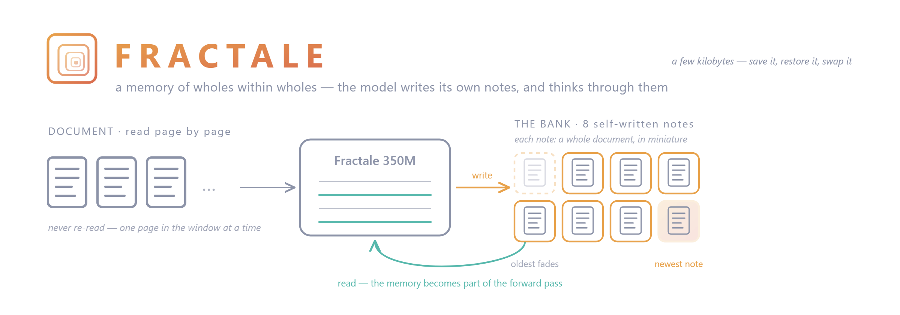
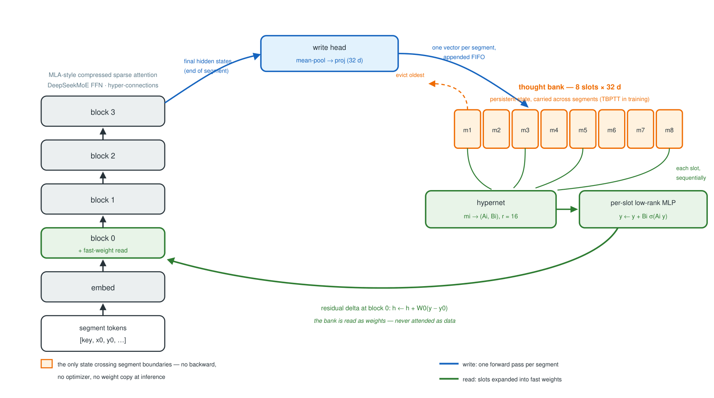

# Thought Bank

[](https://doi.org/10.5281/zenodo.21225721)

Research repo exploring **persistent thought memory** for language models: a
**bank** the model writes to in-line, *outside* its context window, and reads
back by attention — session state that survives context resets at zero window
cost. The active line of work is **`deepseek_v4_mini`**, a small DeepSeek-style
architecture fused with that bank.

**Where the project is now** — the current design and its open questions live
in **[SPEC_MEMOIRE_V2.md](SPEC_MEMOIRE_V2.md)** (the claim, the architecture,
the registry of pending decisions), with
[EXPERIMENTS.md](EXPERIMENTS.md) (experiment tree),
[FINDINGS.md](FINDINGS.md) (newest-first journal) and
[assets/diagramme_banque.html](assets/diagramme_banque.html) (architecture
diagram) as companions.

## 📄 Paper

**A Trained Fast-Weight Memory: Continual Rule Binding at Inference
Without Backward** — [PDF](paper/paper.pdf) ·
[DOI 10.5281/zenodo.21225721](https://doi.org/10.5281/zenodo.21225721)
(this version; all versions: [10.5281/zenodo.21222901](https://doi.org/10.5281/zenodo.21222901))

The paper corresponds to tag
[`V0.2.2-preprint`](https://github.com/kkuette/thought-bank/tree/V0.2.2-preprint),
archived at the DOI above; `main` continues to evolve past it.

Three claims, all on a 3.08M-parameter DeepSeek-style trunk with an
8-slot bank, two seeds:

1. **A functional, generalizing memory**: a single 13-token presentation
   installs a *never-trained* rule binding at **0.79–1.00** accuracy on
   unseen queries (chance 0.008), retained past physical slot eviction,
   replaced mid-conversation in one forward pass (old-rule persistence
   0.000).
2. **The only functional adaptation pathway**: on the same conversations,
   test-time training fits its adaptation examples (0.99) and transfers
   **exactly nothing**, at **138×** the cost per update and −62%
   catastrophic interference on a concurrent rule (bank: −14%, by
   eviction); in-window ICL is at chance.
3. **Memory policy is a trained behaviour, not an architectural
   property**: the identical architecture trained on fixed-structure
   conversations perseverates totally on a rule switch, zero-shot
   (old-rule persistence 1.000, unreadable dirty-bank writes);
   randomizing conversation *structure* at training time installs the
   full policy.

Reproduce Tables 1–4 and Figures 3–5 from a fresh clone:
```bash
bash repro/run_all.sh               # 3 training runs (~5 h each, one RTX 3090) + probes + figures
bash repro/run_all.sh --skip-train  # probes + figures on existing checkpoints
```

The driving questions, in the order they were answered:
1. *Is an external memory bank useful at all, and when?* → only when persistent,
   and judged by `content_gap` ([historical findings](#-findings-historical-memory-as-data-era)).
2. *Can a rule cross turn boundaries as a fast weight?* → yes — after a
   teacher-forced bootstrap breaks the ignore-bank fixed point (§5 of the paper).
3. *Does it generalize to never-trained rules?* → **yes, given rule diversity**:
   held 0.79–1.00 at 112 training rules; ≤25 rules → exactly 0.000 (the read
   memorizes; the transition sits in (25, 112]).
4. *Does the memory POLICY (retain / overwrite / write-on-dirty) come with the
   architecture?* → **no — it is a trained behaviour**: zero-shot on a
   fixed-structure model, STICK = 1.000 (total perseveration); trained with
   randomized structure, STICK = 0.000 at every switch position
   ([current findings](#-findings-fast-weight-memory-current)).

> **History:** the project started as a diffusion / 3D-thought-tensor prototype
> (hence the repo's former name). That line was abandoned for the autoregressive
> fast-weight bank; the old code was removed and remains available in git history.

## 🔬 After the paper: the bank on real data, then at scale

The work moved past the synthetic-rule benchmark in three steps, all
documented with exact reproduction commands in **[FINDINGS.md](FINDINGS.md)**
(newest-first journal) and mapped experiment-by-experiment in
**[EXPERIMENTS.md](EXPERIMENTS.md)**:

1. **Real data, from scratch (47M–97M).** The bank as the *only* channel
   carrying a real document (Python code / web text) across 512-token chunks,
   measured by a deferred-continuation loss: a positive bank advantage, flat
   with depth, shown by inference probes to be file-specific content in a
   recency-weighted superposition.
2. **The mechanism arc closes (2026-07-16).** Addressing, eviction,
   cross-modal transfer and warm-restart curriculum all validated at 97M on
   real text — the stack composes, no staged curriculum needed. The `page`
   (reach-back past eviction) stayed dead across four strikes and left the
   critical path; the cascade remains a free deployment flag.
3. **Scale point: a 350M phase-1 run on 10B tokens**, released as
   **[Fractale-350M-base](https://huggingface.co/fractale-lm/Fractale-350M-base)**
   (usage repo: [fractale-lm/fractale](https://github.com/fractale-lm/fractale);
   the model card lives on the Hub).

## 🎯 Current phase: memory v2 — persistence across window RESETs

Since 2026-07-31 the program is re-anchored on
**[SPEC_MEMOIRE_V2.md](SPEC_MEMOIRE_V2.md)**. The claim under test:

> At a bounded, matched context window, a model with a bank (written in-line,
> outside the context) maintains behavioural conditioning AND exact recall
> **across window resets**, at zero window cost — against text compaction and
> transcript RAG, matched in total forwards.

The design is being settled arm-by-arm in a **toy read lab**
([`deepseek_v4_mini/toy_read_lab.py`](deepseek_v4_mini/toy_read_lab.py),
phases 10–12, run on a rig farm via the pre-registered jobs in
[`jobs_p11/`](jobs_p11/) and [`jobs_p12/`](jobs_p12/)). Key verdicts so far
(details and adjudication rules in the spec §3):

- **Attention read wins** — the bank is read by attention over a flat view of
  native vectors (`kvproj`: dedicated K/V projections, unified softmax); the
  fast-weight read of the paper era lost in both regimes and is retired from
  the design.
- **Citation goes through native injection** — every learned readout died;
  exact recall = retrieve-then-inject native embeddings + a copy head
  (validated end-to-end at 350M: the `copy` run).
- **max_mem = 8 for the graft** — flat attention collapses between 8 and 16
  slots with real distractors; beyond that the hierarchical read (spec §2.8)
  is the only path, with the measured collapse as its baseline.
- **Metadata are rotations on reserved planes** of the dedicated keys — age
  (log-compressed; scale augmentation is what carries the OOD, not the log
  itself) and provenance channel (whose real domain is pinning and
  selection-filtering, not citation); the local intra-span index was measured
  unnecessary and dropped.

Next step: **graft the v2 read onto the 350M checkpoint** (spec §3, S19-S21),
then the RESET protocol evals (spec §6.4). Active configs are the un-archived
ones under [`deepseek_v4_mini/configs/`](deepseek_v4_mini/configs/); the closed
arcs live in [`configs/archive/`](deepseek_v4_mini/configs/archive/README.md).

---

## 🧠 Core idea (paper era)

> **Note (2026-08):** this section describes the architecture *as published in
> the paper* (fast-weight read). The current design replaces the fast-weight
> read with attention over native vector lines — see
> [SPEC_MEMOIRE_V2.md](SPEC_MEMOIRE_V2.md) §2 and
> [assets/diagramme_banque.html](assets/diagramme_banque.html). The invariants
> survive: write once per turn, FIFO cap, the bank as the only cross-turn
> channel.



- **Text stream** does next-token prediction (CSA/HCA attention + MoE, mHC residuals).
- **The bank is read as fast weights, not attended data**: each slot is expanded
  by a learned hypernet into a low-rank MLP layer; the token stream passes
  *through* the stack of slot-layers. What the model wrote becomes part of its
  own forward pass — a rule inferred at turn 0 can be *applied* at turn 20.
- **Write once per turn** (optionally gated `α·p·m`; gate off in the current
  recipe). The bank is FIFO-capped at `max_mem`.
- The bank is the **only cross-turn channel**: each turn is a separate forward,
  so anything older than the current window must travel through the bank.

Full architecture notes (mHC, CSA, HCA, MoE, thought stream) are in the package
README: [`deepseek_v4_mini/README.md`](deepseek_v4_mini/README.md).

---

## 🚀 Quick start

### Environment
```bash
# conda env used in development
conda activate diffusion-thought          # see setup_environment.sh
pip install -r requirements.txt           # torch, transformers, datasets, ...
python -c "import torch; print('CUDA:', torch.cuda.is_available())"
```
Target hardware: a single 24 GB GPU (RTX 3090).

### Train — current program

The live entry point is `code_defer_native` (native from-scratch, deferred
continuation, cascade memory). Phase 1 pretraining and phase 2 chat SFT are
both configs of that same trainer; the `chat:` block is what switches a run
from pretraining to SFT.

```bash
# phase 1 — pretraining (the 350M lineage)
python -m deepseek_v4_mini.code_defer_native deepseek_v4_mini/configs/v350_phase1_10b.yaml

# citation wing — SFT recall with the copy head (the validated 350M chain)
python -m deepseek_v4_mini.code_defer_native deepseek_v4_mini/configs/sft_recall_350m_copy.yaml

# toy read lab — the design cells of memory v2 (see jobs_p11/, jobs_p12/)
python -m deepseek_v4_mini.toy_read_lab deepseek_v4_mini/configs/toy_read_lab_d512_p12.yaml

# GRPO, disaggregated workers/learner
python -m deepseek_v4_mini.rl_disagg deepseek_v4_mini/configs/rl_disagg_350m.yaml

# before any pod bring-up: the hermetic CPU self-tests
scripts/selftest.sh
```

Configs write relative to `${TB_ROOT}`, which defaults to `.` — out of the
box a run puts its dataset cache, checkpoints and metrics inside the repo
(`./data_cache`, `./checkpoints/<run>`, `./runs/<run>`). Point it elsewhere
with one variable, no config edit:

```bash
TB_ROOT=/mnt/big_volume python -m deepseek_v4_mini.code_defer_native <config>
```

The `chat.stream` key of an SFT config picks the conversation stream from the
registry in [`deepseek_v4_mini/streams.py`](deepseek_v4_mini/streams.py)
(`sota_session`, `tool_session`, `code_exec`, `persona`, `math_school`, or
`chat_mix` to weight several of them).

### Train — reproducing the paper (closed arc)

`train.py` is the trainer of the dsv4mini toy arc. It is kept working for
repro; it is not where the current program runs.

```bash
# language modelling
python -m deepseek_v4_mini.train deepseek_v4_mini/configs/archive/dsv4mini/tiny.yaml      # ~19M, TinyStories
python -m deepseek_v4_mini.train deepseek_v4_mini/configs/archive/dsv4mini/code.yaml      # code, per-sequence reset
python -m deepseek_v4_mini.train deepseek_v4_mini/configs/archive/dsv4mini/code_persist.yaml  # code, PERSISTENT bank

# memory diagnostics (synthetic, no tokenizer)
python -m deepseek_v4_mini.train deepseek_v4_mini/configs/archive/dsv4mini/synth_recall.yaml  # addressable recall
python -m deepseek_v4_mini.train deepseek_v4_mini/configs/archive/dsv4mini/gist.yaml          # latent-context gist

# the paper's cells (keyed fresh-rule benchmark, S=128)
python -m deepseek_v4_mini.train deepseek_v4_mini/configs/archive/dsv4mini/multiturn_rule_k2_inter_s128_dsv4m.yaml        # fixed structure (zero-shot arm)
python -m deepseek_v4_mini.train deepseek_v4_mini/configs/archive/dsv4mini/multiturn_rule_k2_inter_s128struct_dsv4w.yaml  # policy cell, seed 42
python -m deepseek_v4_mini.train deepseek_v4_mini/configs/archive/dsv4mini/multiturn_rule_k2_inter_s128struct_dsv4w_s43.yaml  # replication, seed 43

# or everything at once (training + probes + figures):
bash repro/run_all.sh
```
> Scripts importing the package need `PYTHONPATH=<repo-root>`.

### Use the model
```python
from deepseek_v4_mini import ThoughtBankLM, ThoughtBankConfig
import torch

cfg   = ThoughtBankConfig.tiny()
model = ThoughtBankLM(cfg)
ids   = torch.randint(0, cfg.vocab_size, (2, 64))

out  = model(ids)                            # first segment: fresh (random-seed) bank
out2 = model(ids, init_mem=out["mem_bank"])  # carry the bank to the next segment
```

To probe a paper checkpoint instead:
```python
cfg   = ThoughtBankConfig.from_yaml("deepseek_v4_mini/configs/archive/dsv4mini/multiturn_rule_k2_inter_s128struct_dsv4w_s43.yaml")
model = ThoughtBankLM(cfg)
model.load_state_dict(torch.load("checkpoints/multiturn_rule_k2_inter_s128_dsv4w_s43/step_4000.pt",
                                 map_location="cpu")["model"])
```
> Most toy-arc checkpoints were purged across campaigns: the repro path is to
> re-run the archived config, not to reload a checkpoint. See
> [`deepseek_v4_mini/analysis/README.md`](deepseek_v4_mini/analysis/README.md)
> for which ones still exist and what to re-run for the rest.

---

## 🔬 Measuring whether the memory helps

Two probes run during training and write to `runs/<run_name>/metrics.jsonl`:

| Metric | Meaning |
|---|---|
| `mem_ablation_gap` | CE without the bank − CE with it, on the same tokens (>0 ⇒ helps) — but ablating removes the **whole** cross-modal pathway, not just content |
| `mem_diversity` | std across bank slots (~0 ⇒ slots collapsed = useless) |
| `mem_write_rate` (α) | mean write probability — does the model choose to write? |
| `persist_gap` | (persistent runs) CE with the bank **carried across chunks** of one file vs reset each chunk. **Conflates content and structure** — see below; kept as the legacy headline |
| **`content_gap`** | **the metric to trust**: CE with writes **zeroed** vs real, slot count held identical — the *pure* benefit of what is written into the bank |
| `structure_gap` | `persist_gap − content_gap`: the part explained by slot count + slot positional embeddings, independent of content |

Offline analysis: [`deepseek_v4_mini/eval_memory.py`](deepseek_v4_mini/eval_memory.py)
(PPL with vs without the bank).

---

## 📊 Findings — fast-weight memory (current)

Benchmark: keyed fresh-rule conversations (`multiturn_rule_k2_inter_s128*`) —
each conversation binds K=2 key tokens to fresh shift rules `y=(x+s)%128`
(112 training offsets / 15 held out, never trained), presents each rule once
(13 tokens), then queries **unseen** symbols on later turns; the rule can only
cross turn boundaries through the bank. Chance 0.008; bank ablation is an
exact control and sits at chance everywhere.

| Question | Verdict |
|---|---|
| Can a fresh rule be installed at inference, forward-only? | **Yes** — one 13-token presentation → 0.95–1.00 (train) on unseen queries |
| Does it generalize to never-trained rules? | **Yes** — held 0.79–1.00 across two seeds, *given diversity*: at ≤25 training rules held is exactly 0.000 (the read memorizes); at 112 rules held tracks train. Transition in (25, 112] |
| How does it compare to test-time training? | TTT on the same conversations fits its 12 adaptation pairs (0.99) and transfers **nothing** (chance on unseen queries, all LRs × 1–50 steps); in-window ICL also at chance. The bank is the **only** functional adaptation pathway, at 1/138th the cost per update |
| Can a rule be replaced mid-conversation? | **Yes** — one forward on the dirty bank: 0.95 train / 0.78 held post-switch, old-rule persistence (STICK) 0.000 at every switch position 2–14; the untouched key loses −14% (eviction pressure) where sequential TTT loses −62% (catastrophic interference) |
| Does FIFO eviction kill retention? | **No cliff** (structure-randomized model) — storage is a redundant superposition: the 8 slots carry near-copies of one superposed vector (bank eff. rank ~1.1–1.5/8, ablation gap +4.6 nats), the key-conditioned read disambiguates; evicting a slot removes a copy, not the content |
| Is the memory policy architectural? | **No — it is trained.** The same architecture at matched held competence, trained on *fixed* structure, perseverates totally zero-shot (STICK 1.000; its write head cannot produce a readable code on a non-empty bank, 1-NN 0.05). Randomizing conversation structure (lengths 8–16, ≤2 switches at random positions) installs the full policy |
| What is out of reach? | A never-trained rule *family* (subtraction on the same circle) defeats bank, TTT and ICL equally — the boundary is the meta-training envelope, not the mechanism. And replacement *selectivity* bifurcates across seeds (selective update vs flush-and-rewrite), decided at bootstrap |

**Headline: the bank is a functional, generalizing, forward-only memory — and
what it *does* (keep, overwrite, write-on-dirty, survive eviction) is decided
by the training distribution, not by the architecture.** Training it requires
breaking an ignore-the-bank fixed point (teacher-forced Fourier bootstrap +
mastery-gated curriculum + rule diversity; §5 and App. E of the
[paper](paper/paper.pdf)). Mechanistic evidence and probe scripts:
[`deepseek_v4_mini/analysis/`](deepseek_v4_mini/analysis/README.md).

> Earlier findings on the ≤25-rule *memorizing* regime (K=1 0.948, K=2 keyed
> 0.99, emergent rehearsal, switch STICK=0 on a switch-trained model) were
> re-audited on the generalizing regime; the ones that survive are folded into
> the table above, the historical arc is in the
> [package README](deepseek_v4_mini/README.md).

---

## 📊 Findings (historical, memory-as-data era)

**The memory bank only earns its keep when it is allowed to *persist* across
sequences.** Resetting it every sequence (the default) makes it look useless.

A/B on the **same architecture and code dataset**, at matched steps:

| Setup | `ablation_gap` | `persist_gap` | slot `diversity` |
|---|---|---|---|
| per-sequence reset (`code.yaml`) | ~+0.02 → +0.10 | — | ~0.15 |
| **persistent** (`code_persist.yaml`) | **+1.0 → +1.8** | **≈ +0.24–0.30 (stable)** | **~0.41** |

### ⚠️ But most of `persist_gap` is structure, not content

A control on the persistent checkpoint (step 2000, averaged over 6 files)
**decomposes** `persist_gap` by zeroing the written content while keeping the
slot count identical:

| Component | Value | Share |
|---|---|---|
| `persist_gap` (carried vs reset) | **+0.236** | 100% |
| **`content_gap`** (pure content) | **+0.077** | **33%** |
| `structure_gap` (slot count / positions) | +0.159 | 67% |

- **The written content genuinely helps — but modestly.** `content_gap = +0.077`
  was positive on all 6 files (0.046–0.095, σ=0.018), so the bank content is not
  noise. But it is small.
- **~2/3 of the headline `persist_gap` is a structural artifact**: a carried bank
  has ~`max_mem` positionally-encoded slots, a reset one rebuilds from empty, and
  that difference alone moves later-chunk CE — even with a **zero-content** bank
  (the sparse run with α≈0 still showed `persist_gap ≈ +0.32`). So `persist_gap`
  overstates the memory's content value by ~3×. **Trust `content_gap`.**
- Likewise `ablation_gap` is inflated: ablating the bank removes the *entire*
  cross-modal pathway, not just the content, so its large value (+1.0–1.8) mostly
  reflects "the pathway exists", not "the stored thoughts are useful".

### Other findings

- On short / locally-redeterminable data (TinyStories, dense contexts) the gap
  stays small: when the relevant "gist" fits in the attention window, the bank is
  redundant. Memory pays off for **non-local** context beyond the window.
- The bank is a **gist/summary** memory, not an addressable key→value store: the
  synthetic `associative_recall` task does *not* get solved by it (slots collapse
  to a single direction). Use it to remember *what is going on broadly*, not to
  recall exact values.
- The write-decision α **saturates to 1.0** (always write) without a cost — the
  write/skip "choice" decides nothing. A sparsity budget (`mem_write_cost`,
  `cost · E[-log(1-α)]`) gives writing an opportunity cost; applied from step 0 it
  over-corrects (α→0), so it needs a warmup. Judge selectivity by `content_gap`
  holding with fewer writes, not by `persist_gap`.

### Things that were required to get here
- **Next-token alignment**: the loaders pre-shift targets, so the loss must *not*
  shift again — a fixed double-shift had been training a +2-token objective.
- **Write-head gradient**: `mem_bptt_window ≥ 2`, otherwise the write head never
  receives gradient and the bank is filled by an untrained projection.
- **NaN stability**: `muon_lr ≈ 0.003` and `sinkhorn_iters = 20` (the bigger
  levers); RMSNorm variance in fp32; Sinkhorn with per-matrix max-subtract.
- **Sinkhorn at `n_hc = 2`**: the Birkhoff projection has a *closed form* —
  `p = sigmoid((l₀₀+l₁₁−l₀₁−l₁₀)/2)`, `M = [[p,1−p],[1−p,p]]` — so the iteration
  count stops mattering: `model.sinkhorn_closed_form: true` is exact, makes
  `‖B‖₂ ≤ 1` unconditional, drops the `exp` entirely, and removes 26% of the
  forward's aten ops. Every config here runs `n_hc = 2`. Opt-in (default off) so
  existing runs still reproduce; see `mhc._sinkhorn_2x2` for the derivation.

---

## ⚙️ Configs

**Active program** (un-archived, at the root of `deepseek_v4_mini/configs/`):

| File | Purpose |
|---|---|
| `configs/toy_read_lab*.yaml` | the memory-v2 design lab (phases 10–12): read form, rotations, retention, dilution |
| `configs/v350_*.yaml` | 350M phase 1: bring-up, fastpath smoke, the 10B run (`v350_phase1_10b.yaml`), the SIF teacher repass |
| `configs/sft_recall_350m_{copy,rti}.yaml` | the citation wing at 350M (RTI + copy head; `copy` is the validated chain) |
| `configs/rl_*.yaml` | GRPO harness: lives, recall env, disaggregated worker/learner (recall GRPO paused) |
| `configs/sft_*stair*.yaml`, `sft_persona_350m_sif_repass*.yaml` | closed runs kept in place as `init_from` lineages of live configs |
| `configs/code_defer_native_350m.yaml` | 350M native deferred-continuation lineage |
| `configs/farm/` | 350M ablations run on the 3070Ti rig |

**Archive** — the closed arcs, kept because FINDINGS/README and the
`analysis/` probes cite them by name
([details](deepseek_v4_mini/configs/archive/README.md), including
`archive/phase2_350m/` — the persona/SOTA/bring-up-smoke configs closed
2026-07-30):

| File | Dataset / task | Purpose |
|---|---|---|
| `configs/archive/dsv4mini/tiny.yaml` | TinyStories (~19M) | fast LM iteration |
| `configs/archive/dsv4mini/small.yaml` | TinyStories (~32M) | single RTX 3090 |
| `configs/archive/dsv4mini/code.yaml` | codeparrot (Python) | baseline, bank reset per sequence |
| `configs/archive/dsv4mini/code_persist.yaml` | codeparrot (Python) | bank **persists** across steps |
| `configs/archive/dsv4mini/synth_recall.yaml` | synthetic | addressable key→value recall test |
| `configs/archive/dsv4mini/gist.yaml` | synthetic | latent-context (gist) test |
| `configs/archive/dsv4mini/multiturn_rule_k2_inter_s128_dsv4m.yaml` | synthetic | **paper**: fixed-structure cell (Table 2, zero-shot arm of Table 4 / Fig 5) |
| `configs/archive/dsv4mini/multiturn_rule_k2_inter_s128struct_dsv4w*.yaml` | synthetic | **paper**: policy cells, seeds 42/43 (Tables 1/3, Figs 3–5) |
| `configs/archive/dsv4mini/multiturn_rule*.yaml` (others) | synthetic | historical continual-rule family (K=1/K=2, held-out, horizon, switch, joint) — see the [package README](deepseek_v4_mini/README.md) |

Key memory knobs (full list in [`deepseek_v4_mini/README.md`](deepseek_v4_mini/README.md)):

| Parameter | Description |
|---|---|
| `mem_dim`, `max_mem` | thought-vector size and FIFO bank capacity |
| `mem_segment_len` | attention window; smaller ⇒ more reliance on the bank |
| `mem_bptt_window` | TBPTT span; **≥2 required** to train the write head |
| `mem_probe_every` | how often to run the ablation / persistence probes |
| `mem_write_cost` | sparsity budget on α (`cost · E[-log(1-α)]`); 0 = α free to saturate at 1 |
| `data.persist: true` | per-file ordered lanes + carry the bank across steps |

---

## 📁 Repository layout

```
SPEC_MEMOIRE_V2.md       ← THE current spec: claim, architecture, open decisions
EXPERIMENTS.md           ← experiment tree (arc → cells → verdicts)
FINDINGS.md              ← newest-first journal with repro commands
paper/                   ← the paper (paper.pdf, draft.md, figures/)
repro/                   ← end-to-end reproduction of the paper (run_all.sh)
assets/                  ← banner, architecture diagram (diagramme_banque.html)
jobs_p11/, jobs_p12/     ← pre-registered farm jobs of toy-lab phases 11–12
                           (headers carry the predictions + adjudication rules)
deepseek_v4_mini/        ← active project
  model.py  memory.py  attention.py  moe.py  mhc.py  cascade.py  config.py
  muon.py                ← Muon + the param split (shared by every trainer)
  toy_read_lab.py        ← the memory-v2 design lab (phases 10–12)
  code_defer_native.py   ← THE trainer of the 350M line (phase 1 + SFT)
  rti.py  rti_copy.py  rti_policy.py  rti_learner.py  ← citation wing
  recall_env.py          ← paired-lives recall environment
  streams.py             ← name→class registry for conversation streams
  *_data.py              ← the streams: sota_session, tool_env, code_exec,
                           persona, math_school, chat_mix
  rl_disagg.py  rl_lives.py  rl_rewards.py  exec_sandbox.py   ← GRPO + envs
  decode.py  decode_graphs.py  ← unified decode + CUDA-graphs fast path
  train.py               ← trainer of the closed dsv4mini arc (repro only)
  eval_memory.py         ← offline PPL with/without the bank
  analysis/              ← mechanistic diagnostics + campaign results
                           (see its README for repro status per probe)
  legacy/                ← closed arc: the SmolLM2 graft
  configs/               ← active program: toy lab, phase-1 SIF (v350_*),
                           citation SFT, RL (rl_*), 350M ablations (farm/)
    archive/dsv4mini/    ← closed toy arc: tiny, small, code, code_persist,
                           synth_recall, gist, multiturn_rule family
    archive/mechanism/   ← closed native v2/v3 arc (+ farm/ sweeps)
    archive/phase2_350m/ ← closed persona/SOTA arcs + bring-up smokes
scripts/                 ← selftest.sh (hermetic CPU tests), farm/ (rig queue)
legacy/thought_lm_minimal/  ← the 2025 ancestor, kept for the record
checkpoints/, runs/      ← training outputs (gitignored)
```

---

## 📚 References
- DeepSeek-V4 (architecture base), DeepSeekMoE (Dai et al., 2024)
- Hyper-Connections (Zhu et al., 2024), Muon optimizer (Jordan et al., 2024)
- Thought-memory ancestor: [`legacy/thought_lm_minimal/`](legacy/thought_lm_minimal/)

## License

MIT — see [LICENSE](LICENSE). The paper (`paper/`) is distributed under the
arXiv.org perpetual, non-exclusive license.
